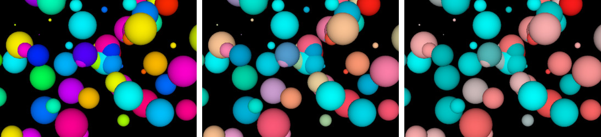

# Only One-pass Shader (oops.js)

**Oops.js** is a library which attempts to squeeze higher performance from Three.js postprocessing effects, by:

* merging the source codes of several shaders
* embedding static uniforms as shader constants

Additionally, the library makes small adjustment to the shaders properties,
so they are not completely the same as their Three.js counterparts.
  
A very preliminary test with the [webgl_postprocessing](https://threejs.org/examples/?q=post#webgl_postprocessing)
example shows increased performance by 50%.

# Supported shaders

* **Shaders about colors:** [BleachBypassShader](#bleachbypassshader), [BrightnessContrastShader](#brightnesscontrastshader), [ColorCorrectionShader](#colorcorrectionshader), [ColorifyShader](#colorifyshader), [ExposureShader](#exposureshader), [ExposureExpShader](#exposureexpshader), [GammaCorrectionShader](#gammacorrectionshader), [RGBShiftShader](#rgbshiftshader), [SepiaShader](#sepiashader), [TechnicolorShader](#technicolorshader), [VignetteShader](#vignetteshader)

* **Shaders about shapes:** [DotScreenShader](#dotscreenshader), [FreiChenShader](#freichenshader), [HorizontalBlurShader](#horizontalblurshader), [KaleidoShader](#kaleidoshader), [MirrorShader](#mirrorshader), [SobelOperatorShader](#sobeloperatorshader),
[VerticalBlurShader](#verticalblurshader)

## BleachBypassShader

A shader that applies the [bleach bypass](https://en.wikipedia.org/wiki/Bleach_bypass)
effect in photography. Shader weight is 1 sweight.
	
* **`amount`** – amount of effect intensity (float, default value 3}

Example: [BleachBypassShader.html](examples/BleachBypassShader.html)
		

		
*Notes: (1) **opacity** is renamed to **amount** and has another default value.*

## BrightnessContrastShader

A shader that changes the brightness and the contract of a frame.
Shader weight is 1 sweight.
	
* **`brightness`** – amount of color brightness (float, from -1 to 1, default value 0}
* **`contrast`** – amount of color contrast (float, from -1 to 1, default value 0}

Example: [BrightnessContrastShader.html](examples/BrightnessContrastShader.html)
		

		

## ColorCorrectionShader

A shader that transforms the colors in a frame by *m*&times;(*color* + *a*)*p*.
Each color component is transformed by its own factors *m*, *a* and *p*.
Shader weight is 1 sweight.
	
* **`mulRGB`** – scaling factor *m* (vector, default value THREE.Vector3(1,1,1)}
* **`addRGB`** – offset factor *a* (vector, default value THREE.Vector3(0,0,0)}
* **`powRGB`** – power factor *p* (vector, default value THREE.Vector3(2,2,2)}

Example: [ColorCorrectionShader.html](examples/ColorCorrectionShader.html)
		

## ColorifyShader

A shader that converts the colors of the frame into specific color. Shader weight is 1 sweight.
	
* **`color`** – target color (vector, default value THREE.Vector3(1,1,1) for white color) 
* **`opacity`** – shader effect opacity (float, 0.0 to 1.0, default value 1.0) 

Example: [ColorifyShader.html](examples/ColorifyShader.html)
		

*Notes: (1) **opacity** is added.*
	

## DotScreenShader

A shader that converts the frame into regularly spread dots.
Shader weight is 1 sweight.
	
* **`scale`** – size of the dots in the pattern (float, default value 1.5}
* **`angle`** – angle of the pattern (float, default value 0)
* **`center`** – center of the pattern (vector, default value THREE.Vector2(0,0))
* **`resolution`** – canvas resolution (vector, default value THREE.Vector2(innerWidth,innerHeight))
* **`opacity`** – shader effect opacity (float, 0.0 to 1.0, default value 1.0) 

Example: [DotScreenShader.html](examples/DotScreenShader.html)
		

*Notes: (1) **tSize** is renamed to **resolution** and
has another default value; (2) **opacity** is added.*

## ExposureShader

A shader that changes the exposure of a frame by myltiplying colors by factor *f*. Exposure factor *f*&lt;1 makes the colors darker, while exposure *f*&gt;1 makes them brighter. Exposure is multiplicative, i.e. the black color does not change and the 'opposite' of *f*=2 is *f*=1/2. Shader weight is 1 sweight.
	
* **`exposure`** – exposure factor (float, default value 1}

Example: [ExposureShader.html](examples/ExposureShader.html)
		

## ExposureExpShader

A shader that changes the exposure of a frame by myltiplying colors by factor *ef*, where *e*&approx;2.718 is the [Euler's number](https://en.wikipedia.org/wiki/E_(mathematical_constant)). Exposure factor *f*&lt;0 makes the colors darker, while exposure *f*&gt;0 makes them brighter. Exposure is linear, i.e. the 'opposite' of *f*=2 is *f*=-2. Shader weight is 1 sweight.
	
* **`exposure`** – exposure factor (float, default value 0}

Example: [ExposureExpShader.html](examples/ExposureExpShader.html)
		

*Notes: (1) this shader is new.*

## FreiChenShader

A shader that marks the edges of shapes based on the Frei-Chen edge detection
algorithm. Shader weight is 10 sweights.
	
* **`resolution`** – canvas resolution (vector, default value THREE.Vector2(innerWidth,innerHeight))
* **`opacity`** – shader effect opacity (float, 0.0 to 1.0, default value 1.0) 

Example: [FreiChenShader.html](examples/FreiChenShader.html)
		

*Notes: (1) **aspect** is renamed to **resolution** and
has another default value; (2) **opacity** is added; (3) a syntax bug in the shader is fixed.*

## GammaCorrectionShader

A shader that applies sRGB electro-optical transfer function (EOTF), which is
approximation of &gamma;=2.2. Shader weight is 1 sweight.
	
* *no parameters*

Example: [GammaCorrectionShader.html](examples/GammaCorrectionShader.html)
		

## HorizontalBlurShader

A shader that blurs the frame horizontally with a Gaussian blur filter. Shader weight is 9 sweights.
	
* **`resolution`** – canvas width (float, default value innerWidth)
* **`amount`** – amount of shader effect (float, default value 1.0) 

Example: [HorizontalBlurShader.html](examples/HorizontalBlurShader.html)
		

*Notes: (1) **h** is renamed to **resolution**,
it is not 1/*width* and has another default value; (2) **amount** is added.*
		

## KaleidoShader

A shader that mirrors a pie fragment of the frame into a [kaleidoscopic](https://en.wikipedia.org/wiki/Kaleidoscope) image. Shader weight is 1 sweight.
	
* **`sides`** – number of side of the kaleidoscope image (int, 3 or more, default value 6)
* **`angle`** – rotation of the kaleidoscope image in radians (float, default value 0)
* **`resolution`** – canvas resolution (vector, default value THREE.Vector2(innerWidth,innerHeight))

Example: [KaleidoShader.html](examples/KaleidoShader.html)
		

*Notes: (1) added **resolution** and
fixed aspect.*

## MirrorShader

A shader that mirrors half of the frame onto the other half. Shader weight is 1 sweight.
	
* **`side`** – which half frame is the source of mirror (int, 0=left&rarr;right, 1=right&rarr;left, 2:top&rarr;bottom, 3:bottom&rarr;top, default value 1)

Example: [MirrorShader.html](examples/MirrorShader.html)
		

		

## RGBShiftShader

A shader that splits the color components of the frame and shifts them apart.
Shader weight is 3 sweights.

* **`amount`** – amount of shift (float, in NDC space units, default value 0.005)
* **`angle`** – angle of offset (float, in radians, default value 0.0)
* **`opacity`** – shader effect opacity (float, 0.0 to 1.0, default value 1.0) 

Example: [RGBShiftShader.html](examples/RGBShiftShader.html)
		

*Notes: (1) **opacity** is added.*

## SepiaShader

A shader that recolors the frame into sepia hue. Shader weight is 1 sweight.

* **`amount`** – amount of recoloring (float, from 0 to 1, default value 1)

Example: [SepiaShader.html](examples/SepiaShader.html)
		

		

## SobelOperatorShader

A shader that marks the edges of shapes based on the red color component in the frame.
Shader weight is 9 sweights.
	
* **`resolution`** – canvas resolution (vector, default value THREE.Vector2(innerWidth,innerHeight))
* **`opacity`** – shader effect opacity (float, 0.0 to 1.0, default value 1.0) 

Example: [SobelOperatorShader.html](examples/SobelOperatorShader.html)
		

*Notes: (1) **resolution** 
has another default value; (2) **opacity** is added.*

## TechnicolorShader

A shader that converts the colors of the frame into Technicolor cyan-red hues. Shader weight is 1 sweight.
	
* **`opacity`** – shader effect opacity (float, 0.0 to 1.0, default value 1.0) 

Example: [TechnicolorShader.html](examples/TechnicolorShader.html)
		

*Notes: (1) **opacity** is added.*

## VerticalBlurShader

A shader that blurs the frame vertically with a Gaussian blur filter. Shader weight is 9 sweights.
	
* **`resolution`** – canvas height (float, default value innerHeight)
* **`amount`** – amount of shader effect (float, default value 1.0) 

Example: [VerticalBlurShader.html](examples/VerticalBlurShader.html)
		

*Notes: (1) **h** is renamed to **resolution**,
it is not 1/*height* and has another default value; (2) **amount** is added.*

## VignetteShader

A shader that adds a vignette effect on the frame. Shader weight is 1 sweight.
	
* **`radius`** – internal vignette radius (float, in NDC space units, default value 1.0)
* **`blur`** – amount of blur effect on vignette border (float, 0 for no blur, default value 1.0) 
* **`color`** – vignette color (vector, default value THREE.Vector3(0,0,0) for black color) 

Example: [VignetteShader.html](examples/VignetteShader.html)
		

*Notes: (1) the shader is written from scratch
and is unrelated with the Three.js VignetteShader.*
	

# To do

 ACESFilmicToneMappingShader
 AfterimageShader
 BasicShader
 <b style="background:palegreen; color: black; padding:0.3em;">BleachBypassShader</b>
 BlendShader
 BokehShader
 BokehShader2
 <b style="background:palegreen; color: black; padding:0.3em;">BrightnessContrastShader</b>
 <b style="background:palegreen; color: black; padding:0.3em;">ColorCorrectionShader</b>
 <b style="background:palegreen; color: black; padding:0.3em;">ColorifyShader</b>
 ConvolutionShader
 CopyShader
 DepthLimitedBlurShader
 DigitalGlitch
 DOFMipMapShader
 <b style="background:palegreen; color: black; padding:0.3em;">DotScreenShader</b>
 <b style="background:palegreen; color: black; padding:0.3em;">ExposureShader</b>
 <b style="background:palegreen; color: black; padding:0.3em;">ExposureExpShader</b>
 FilmShader
 FocusShader
 <b style="background:palegreen; color: black; padding:0.3em;">FreiChenShader</b>
 FXAAShader
 <b style="background:palegreen; color: black; padding:0.3em;">GammaCorrectionShader</b>
 GodRaysShader
 HalftoneShader
 <b style="background:palegreen; color: black; padding:0.3em;">HorizontalBlurShader</b>
 HorizontalTiltShiftShader
 HueSaturationShader
 <b style="background:palegreen; color: black; padding:0.3em;">KaleidoShader</b>
 LuminosityHighPassShader
 LuminosityShader
 <b style="background:palegreen; color: black; padding:0.3em;">MirrorShader</b>
 MMDToonShader
 NormalMapShader
 OutputShader
 <b style="background:palegreen; color: black; padding:0.3em;">RGBShiftShader</b>
 SAOShader
 <b style="background:palegreen; color: black; padding:0.3em;">SepiaShader</b>
 SMAAShader
 <b style="background:palegreen; color: black; padding:0.3em;">SobelOperatorShader</b>
 SSAOShader
 SSRShader
 SubsurfaceScatteringShader
 <b style="background:palegreen; color: black; padding:0.3em;">TechnicolorShader</b>
 ToonShader
 TriangleBlurShader
 UnpackDepthRGBAShader
 VelocityShader
 <b style="background:palegreen; color: black; padding:0.3em;">VerticalBlurShader</b>
 VerticalTiltShiftShader
 <b style="background:palegreen; color: black; padding:0.3em;">VignetteShader</b>
 VolumeShader
 WaterRefractionShader
