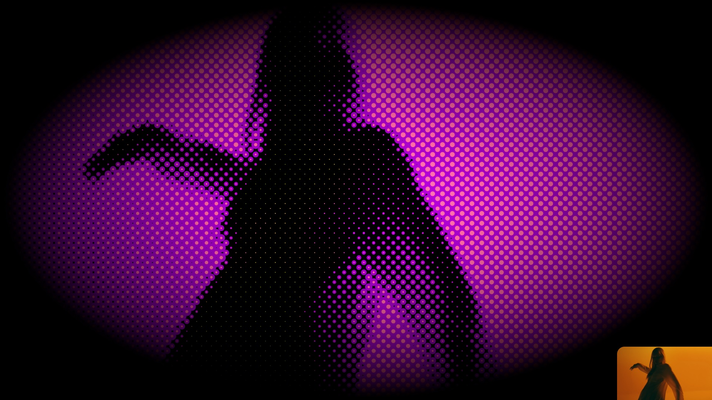

# Tutorials

This page describes the Oops.js API and demonstrates its features.

## Video effect demo

This demo displayes a video via a [video texture](https://threejs.org/docs/#api/en/textures/VideoTexture)
and applies 4 postprocessing effects onto it:
* [Halftone](../examples/index.md#halftoneshader) to create dotted pattern of the video
* [HueSaturation](../examples/index.md#huesaturationshader) to change dynamically the color
* [Vignette](../examples/index.md#vignetteshader) to frame the image in an ellipse
* [TriangleBlur](../examples/index.md#triangleblurshader) to smooth effect transitions

Run: [Video effect demo](video-effect/index.html)
	

