# Examples

This page lists short online demos for supported shaders. 
They can be used to play with the shaders' parameters.

## Contents

[ACESFilmicToneMappingShader](#acesfilmictonemappingshader)
&middot; AfterimageShader
&middot; [BasicShader](#basicshader)
&middot; [BleachBypassShader](#bleachbypassshader)
&middot; BlendShader
&middot; BokehShader
&middot; BokehShader2
&middot; [BrightnessContrastShader](#brightnesscontrastshader)
&middot; [ColorCorrectionShader](#colorcorrectionshader)
&middot; [ColorifyShader](#colorifyshader)
&middot; [ConvolutionShader](#convolutionshader)
&middot; [CopyShader](#copyshader)
&middot; DepthLimitedBlurShader
&middot; DigitalGlitch
&middot; DOFMipMapShader
&middot; [DotScreenShader](#dotscreenshader)
&middot; [ExposureShader](#exposureshader)
&middot; [ExposureExpShader](#exposureexpshader)
&middot; [FilmShader](#filmshader)
&middot; [FocusShader](#focusshader)
&middot; [FreiChenShader](#freichenshader)
&middot; [FXAAShader](#fxaashader)
&middot; [GammaCorrectionShader](#gammacorrectionshader)
&middot; GodRaysShader
&middot; [HalftoneShader](#halftoneshader)
&middot; [HorizontalBlurShader](#horizontalblurshader)
&middot; [HorizontalTiltShiftShader](#horizontaltiltshiftshader)
&middot; [HueSaturationShader](#huesaturationshader)
&middot; [KaleidoShader](#kaleidoshader)
&middot; [LuminosityHighPassShader](#luminosityhighpassshader)
&middot; [LuminosityShader](#luminosityshader)
&middot; [MirrorShader](#mirrorshader)
&middot; MMDToonShader
&middot; NormalMapShader
&middot; OutputShader
&middot; [RGBShiftShader](#rgbshiftshader)
&middot; SAOShader
&middot; [SepiaShader](#sepiashader)
&middot; SMAAShader
&middot; [SobelOperatorShader](#sobeloperatorshader)
&middot; SSAOShader
&middot; SSRShader
&middot; SubsurfaceScatteringShader
&middot; [TechnicolorShader](#technicolorshader)
&middot; ToonShader
&middot; [TriangleBlurShader](#triangleblurshader)
&middot; [UnpackDepthRGBAShader](#unpackdepthrgbashader)
&middot; VelocityShader
&middot; [VerticalBlurShader](#verticalblurshader)
&middot; [VerticalTiltShiftShader](#verticaltiltshiftshader)
&middot; [VignetteShader](#vignetteshader)
&middot; VolumeShader
&middot; WaterRefractionShader

## ACESFilmicToneMappingShader
[ type: O1 ]

A shader that applies filmic tonemap to the frame as defined
by the Academy Color Encoding System.
	
* **`exposure`** – exposure factor (float, from 0 to 2, default value 1.0) 

Example: [ACESFilmicToneMappingShader.html](ACESFilmicToneMappingShader.html)
		

*Notes: (1) **exposure** range is expanded.*
	

## BasicShader
[ type: O0 ]

A basic and simple test shader that fills the frame with a gradient color.
	
* **`color`** – fill color (color, default value THREE.Color(1,0,0) for red color) 

Example: [BasicShader.html](BasicShader.html)
		
[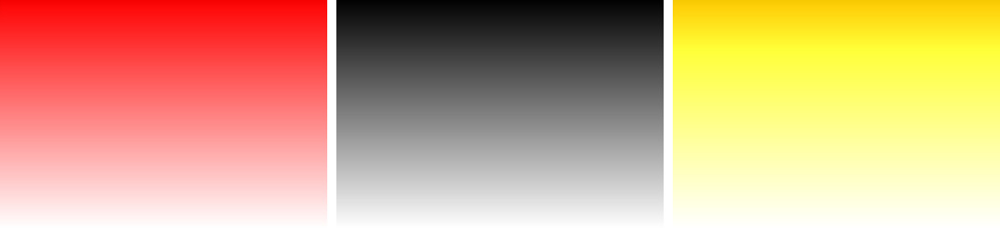](BasicShader.html)

*Notes: (1) **color** is added.*
	

## BleachBypassShader
[ type: O1 ]

A shader that applies the [bleach bypass](https://en.wikipedia.org/wiki/Bleach_bypass)
effect in photography.
	
* **`amount`** – amount of effect intensity (float, default value 3)

Example: [BleachBypassShader.html](BleachBypassShader.html)
		
[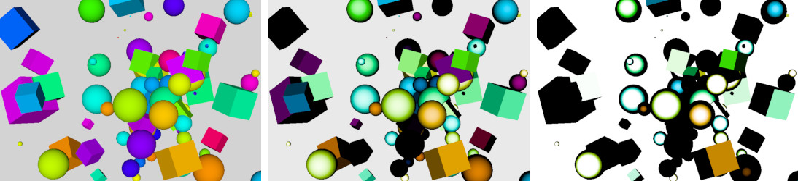](BleachBypassShader.html)
		
*Notes: (1) **opacity** is renamed to **amount** and has another default value.*

## BrightnessContrastShader
[ type: O1 ]

A shader that changes the brightness and the contract of a frame.
	
* **`brightness`** – amount of color brightness (float, from -1 to 1, default value 0)
* **`contrast`** – amount of color contrast (float, from -1 to 1, default value 0)

Example: [BrightnessContrastShader.html](BrightnessContrastShader.html)
		
[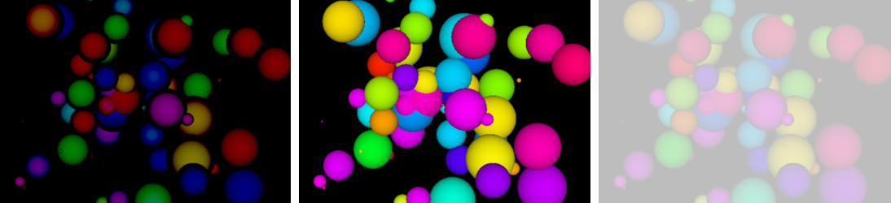](BrightnessContrastShader.html)
		

## ColorCorrectionShader
[ type: O1 ]

A shader that transforms the colors in a frame by *m*&times;(*color* + *a*)*p*.
Each color component is transformed by its own factors *m*, *a* and *p*.
	
* **`mulRGB`** – scaling factor *m* (vector, default value THREE.Vector3(1,1,1))
* **`addRGB`** – offset factor *a* (vector, default value THREE.Vector3(0,0,0))
* **`powRGB`** – power factor *p* (vector, default value THREE.Vector3(2,2,2))

Example: [ColorCorrectionShader.html](ColorCorrectionShader.html)
		
[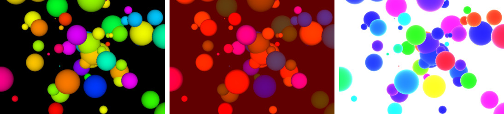](ColorCorrectionShader.html)

## ColorifyShader
[ type: O1 ]

A shader that converts the colors of the frame into specific color.
	
* **`color`** – target color (color, default value THREE.Color(1,1,1) for white color) 
* **`opacity`** – shader effect opacity (float, 0.0 to 1.0, default value 1.0) 

Example: [ColorifyShader.html](ColorifyShader.html)
		
[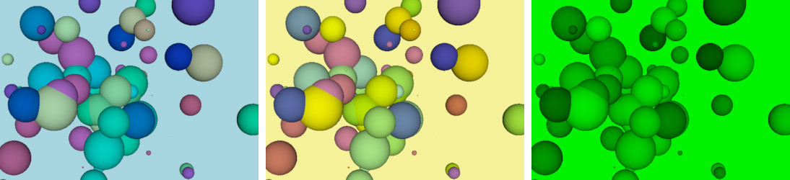](ColorifyShader.html)

*Notes: (1) **opacity** is added.*

## ConvolutionShader
[ type: O25 ]

A shader that applies 1D convolution to the colors of the frame. Convolution is
used to apply blur, sharpen, edge detection and other filters, based on a kernel. The
[kernel](https://en.wikipedia.org/wiki/Kernel_(image_processing)) is an array of
25 floats.
	
* **`uImageIncrement`** – sampling points increment (vector, default value THREE.Vector2(0,0)) 
* **`cKernel`** – convolution kernel (array float[25], default values Gauss blur) 

Example: [ConvolutionShader.html](ConvolutionShader.html)
		
[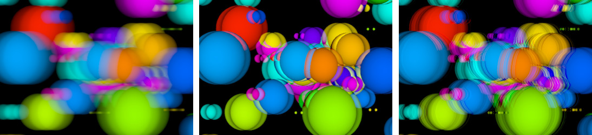](ConvolutionShader.html)

	

## CopyShader
[ type: O1 ]

A shader that just copies the frame multiplying each color with opacity factor.
	
* **`opacity`** – opacity factor (float, 0.0 to 1.0, default value 1.0) 

Example: [CopyShader.html](CopyShader.html)
		
[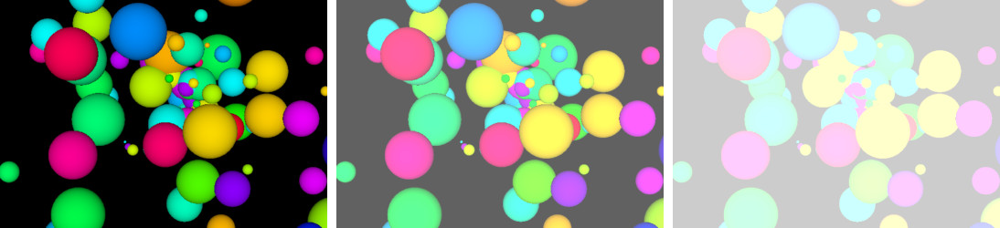](CopyShader.html)

## DotScreenShader
[ type: O1 ]

A shader that converts the frame into regularly spread dots.
	
* **`scale`** – size of the dots in the pattern (float, default value 1.5)
* **`angle`** – angle of the pattern (float, default value 0)
* **`center`** – center of the pattern (vector, default value THREE.Vector2(0,0))
* **`opacity`** – shader effect opacity (float, 0.0 to 1.0, default value 1.0) 

Example: [DotScreenShader.html](DotScreenShader.html)
		
[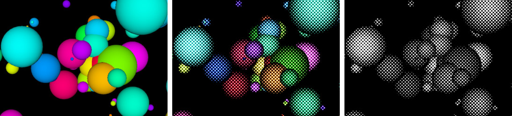](DotScreenShader.html)

*Notes: (1) **opacity** is added.*

## ExposureShader
[ type: O1 ]

A shader that changes the exposure of a frame by myltiplying colors by factor *f*.
Exposure factor *f*&lt;1 makes the colors darker, while exposure *f*&gt;1 makes
them brighter. Exposure is multiplicative, i.e. the black color does not change
and the 'opposite' of *f*=2 is *f*=1/2.
	
* **`exposure`** – exposure factor (float, default value 1)

Example: [ExposureShader.html](ExposureShader.html)
		
[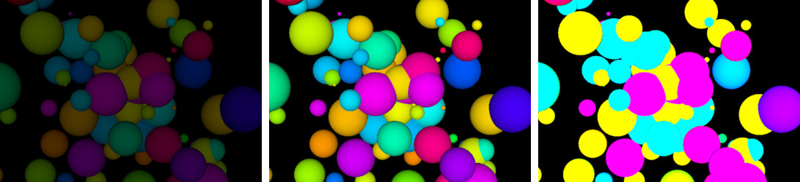](ExposureShader.html)

## ExposureExpShader
[ type: O1 ]

A shader that changes the exposure of a frame by myltiplying colors by factor
*ef*, where *e*&approx;2.718 is the
[Euler's number](https://en.wikipedia.org/wiki/E_(mathematical_constant)).
Exposure factor *f*&lt;0 makes the colors darker, while exposure *f*&gt;0 makes
them brighter. Exposure is linear, i.e. the 'opposite' of *f*=2 is *f*=-2.
	
* **`exposure`** – exposure factor (float, default value 0)

Example: [ExposureExpShader.html](ExposureExpShader.html)
		

*Notes: (1) this shader is new.*

## FilmShader
[ type: O1 ]

A shader that adds graininess to the frame. 
	
* **`intensity`** – intensity of graininess (float, 0.0 to 3.0, default value 0.5) 
* **`grayscale`** – a flag whether to convert the colors to grayscale (boolean, default value false) 

Example: [FilmShader.html](FilmShader.html)
		

*Notes: (1) the calculation of
grains is modified to support stronger graininess; (2) **intensity** has
a different range.*

## FocusShader
[ type: O8 ]

A shader that blurs the frame by keeping the center more focused.
	
* **`sampleDistance`** – non-linear component of the blur effect (float, 0.0 to 2.0, default value 0.94)
* **`waveFactor`** – linear component of the blur effect (float, 0.0 to 2.0, default value 0.125)

Example: [FocusShader.html](FocusShader.html)
		
[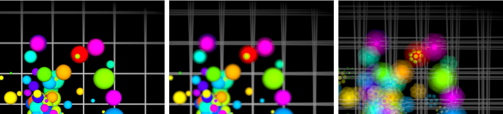](FocusShader.html)

*Notes: (1) **waveFactor** is scaled by 100.*

## FreiChenShader
[ type: O10 ]

A shader that marks the edges of shapes based on the Frei-Chen edge detection
algorithm.
	
* **`opacity`** – shader effect opacity (float, 0.0 to 1.0, default value 1.0) 

Example: [FreiChenShader.html](FreiChenShader.html)
		

*Notes: (1) **opacity** is added; (3) a syntax bug in the shader is fixed.*

## FXAAShader
[ type: O17 ]

A shader that implements a variation of the [FXAA (Fast approximate anti-aliasing)](https://en.wikipedia.org/wiki/Fast_approximate_anti-aliasing) screen-space anti-aliasing.
	
* **`resolution`** – canvas resolution (vector, default value THREE.Vector2(innerWidth,innerHeight))
* **`disable`** - flag for disabling the shader (boolean, default value *false*)

Example: [FXAAShader.html](FXAAShader.html)
		
[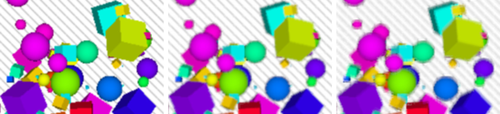](FXAAShader.html)

*Notes: (1) **resolution** uses size in pixels; (2) **disable** is added; (3) texture sampling is without bias.*

## GammaCorrectionShader
[ type: O1 ]

A shader that applies sRGB electro-optical transfer function (EOTF), which is
approximation of &gamma;=2.2. 
	
* *no parameters*

Example: [GammaCorrectionShader.html](GammaCorrectionShader.html)
		

## HalftoneShader
[ type: O109 ]

A shader that converts the colors in the frame into [overlapping single-color patterns](https://en.wikipedia.org/wiki/Halftone) of shapes. 

* **`shape`** – pattern shape: *dot*=1, *ellipse*=2, *line*=3 and *square*=4  (int, from 1 to 4, default value 1 for dot)
* **`radius`** – size of the pattern shapes (float, from 1 to 20, default value 4)
* **`scatter`** – amount of pattern distortion (float, from 0 to 10, default value 0),
* **`rotate`** – rotation-vector of the patterns in radians, the *x*, *y* and *z* components define the rotation of red, green and blue patterns (vector, each component is from 0 to 2&pi;, default value THREE.Vector3(&pi;/12,2&pi;/12,3&pi;/12) which correponds to 15&deg;, 30&deg; and 45&deg;)
* **`blending`** – blending strength/opacity (float, from 0.0 to 1.0, default value 1.0)
* **`blendingMode`** – defines how the halftone image is blended with the original frame: *linear*=1, *multiply*=2, *add*=3, *lighter*=4 and *darker*=5 (int, from 1 to 5, default value 1 for linear)
* **`grayscale`** - flag for grayscale effect (boolean, default value *false*)
* **`disable`** - flag for disabling the shader (boolean, default value *false*)

Example: [HalftoneShader.html](HalftoneShader.html)
		

*Notes: (1) **rotateR**, **rotateG** and **rotateB** merged into vector **rotate**; (2) **greyscale** is renamed to **grayscale**.*

## HorizontalBlurShader
[ type: O9 ]

A shader that blurs the frame horizontally with a Gaussian blur filter. 
	
* **`resolution`** – canvas width (float, default value innerWidth)
* **`amount`** – amount of shader effect (float, default value 1.0) 

Example: [HorizontalBlurShader.html](HorizontalBlurShader.html)
		
[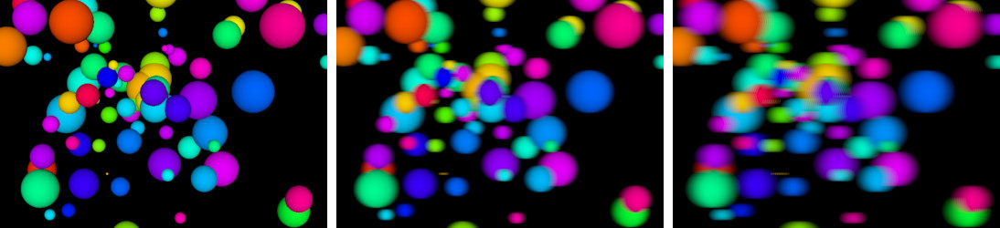](HorizontalBlurShader.html)

*Notes: (1) **h** is renamed to **resolution**,
it is not 1/*width* and has another default value; (2) **amount** is added.*

## HorizontalTiltShiftShader
[ type: O9 ]

A shader that fakes a horizontal tilt-shift effect, i.e. the areas above and below a horizontal area are blured.
	
* **`position`** – vertical position of the horizontal area (float, in NDC space units from 0 to 1, default value 0.5)
* **`span`** – the vertical size of the horizontal area (float, in NDC space units from 0 to 0.5, default value 0.1)
* **`amount`** – amount of blur effect (float, from 0 to 10, default value 1.0) 

Example: [HorizontalTiltShiftShader.html](HorizontalTiltShiftShader.html)
		
[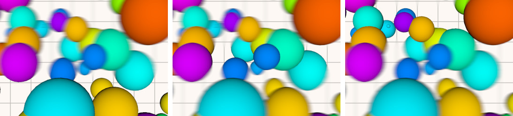](HorizontalTiltShiftShader.html)

*Notes: (1) entirely different parameters; (2) entirely different calculation of blurred areas.*

## HueSaturationShader
[ type: O1 ]

A shader that changes the [hue](https://en.wikipedia.org/wiki/Hue) (the colorness
of colors, like *red*, *green* or *yellow*) and the
[saturation](https://en.wikipedia.org/wiki/Colorfulness#Saturation)
(the colorfulness or strength of colors, line *gray* or *colorful*) of a frame.
	
* **`hue`** – relative change of hue (float, from -1 to 1, default value 0)
* **`saturation`** – relative change of saturation (float, from -1 to 1, default value 0)

Example: [HueSaturationShader.html](HueSaturationShader.html)
		
[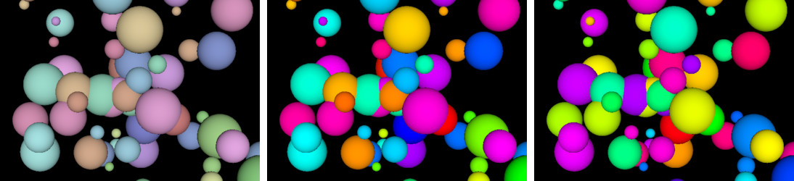](HueSaturationShader.html)

## KaleidoShader
[ type: O1 ]

A shader that mirrors a pie fragment of the frame into a [kaleidoscopic](https://en.wikipedia.org/wiki/Kaleidoscope) image.
	
* **`sides`** – number of side of the kaleidoscope image (int, 3 or more, default value 6)
* **`angle`** – rotation of the kaleidoscope image in radians (float, default value 0)
* **`resolution`** – canvas resolution (vector, default value THREE.Vector2(innerWidth,innerHeight))

Example: [KaleidoShader.html](KaleidoShader.html)
		
[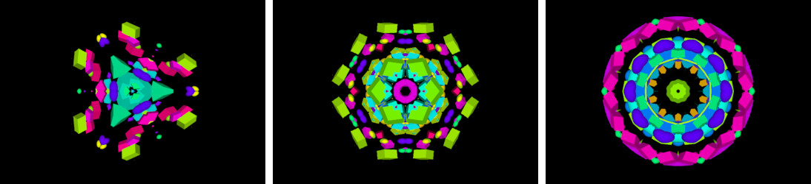](KaleidoShader.html)

*Notes: (1) added **resolution** and
fixed aspect.*

## LuminosityHighPassShader
[ type: O1 ]

A shader that changes a frame by blending colors based on their luminocity.
In contrast to the [LuminosityShader](#luminosityshader), this shader calculates
the luminocity as &approx;30% (red), &approx;59% (green) and &approx;11%(blue).
	
* **`color`** – default color to blend to (color, default value THREE.Color(0,0,0)) 
* **`alpha`** – alpha component of the default color (float, from 0 to 1, default value 0) 
* **`threshold`** – minimal luminocity for blending (float, from -1 to 1, default value 0.25) 
* **`span`** – blending span, i.e. it is applied for luminocities from *threshold+span* to *threshold+span* (float, from -1 to 1, default value 0.25) 

Example: [LuminosityHighPassShader.html](LuminosityHighPassShader.html)
		

*Notes: (1) renamed **defaultColor** to **color**; (2) renamed **defaultOpacity** to **alpha**; (3) renamed **luminosityThreshold** to **threshold** and changed its default value; (4) renamed **smoothWidth** to **span** and changed its default value.*
		

## LuminosityShader
[ type: O1 ]

A shader that converts colors of a frame to grayscale based on luminocity, i.e.
color components contribute with their different factors: &approx;21% (red),
&approx;72% (green) and &approx;7%(blue).
	
* **`opacity`** – shader effect opacity (float, 0.0 to 1.0, default value 1.0) 

Example: [LuminosityShader.html](LuminosityShader.html)
		
[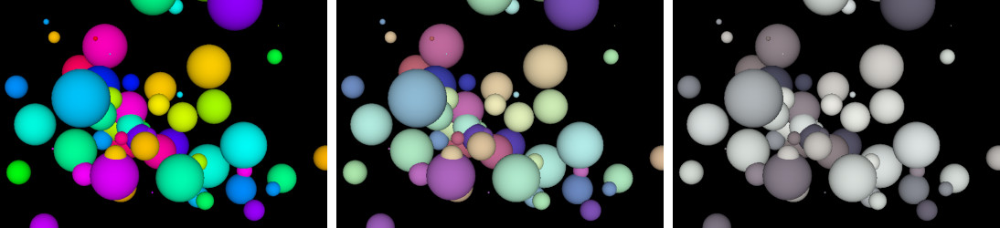](LuminosityShader.html)

*Notes: (1) **opacity** is added.*

## MirrorShader
[ type: O1 ]

A shader that mirrors half of the frame onto the other half.
	
* **`side`** – which half frame is the source of mirror (int, 0=left&rarr;right, 1=right&rarr;left, 2:top&rarr;bottom, 3:bottom&rarr;top, default value 1)

Example: [MirrorShader.html](MirrorShader.html)
		

		

## RGBShiftShader
[ type: O3 ]

A shader that splits the color components of the frame and shifts them apart.

* **`amount`** – amount of shift (float, in NDC space units, default value 0.005)
* **`angle`** – angle of offset (float, in radians, default value 0.0)
* **`opacity`** – shader effect opacity (float, 0.0 to 1.0, default value 1.0) 

Example: [RGBShiftShader.html](RGBShiftShader.html)
		
[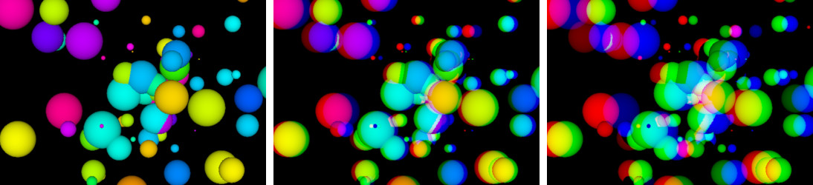](RGBShiftShader.html)

*Notes: (1) **opacity** is added.*

## SepiaShader
[ type: O1 ]

A shader that recolors the frame into sepia hue.

* **`amount`** – amount of recoloring (float, from 0 to 1, default value 1)

Example: [SepiaShader.html](SepiaShader.html)
		
[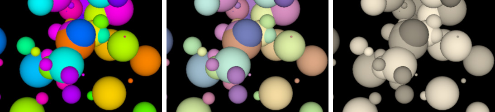](SepiaShader.html)
		

## SobelOperatorShader
[ type: O9 ]

A shader that marks the edges of shapes based on the red color component in the frame.
	
* **`resolution`** – canvas resolution (vector, default value THREE.Vector2(innerWidth,innerHeight))
* **`opacity`** – shader effect opacity (float, 0.0 to 1.0, default value 1.0) 

Example: [SobelOperatorShader.html](SobelOperatorShader.html)
		
[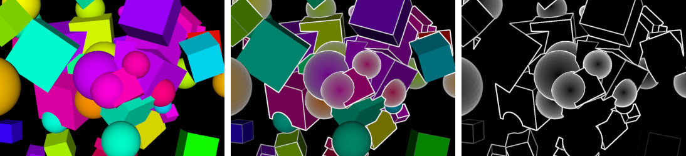](SobelOperatorShader.html)

*Notes: (1) **resolution** 
has another default value; (2) **opacity** is added.*

## TechnicolorShader
[ type: O1 ]

A shader that converts the colors of the frame into Technicolor cyan-red hues.
	
* **`opacity`** – shader effect opacity (float, 0.0 to 1.0, default value 1.0) 

Example: [TechnicolorShader.html](TechnicolorShader.html)
		
[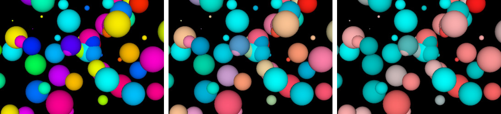](TechnicolorShader.html)

*Notes: (1) **opacity** is added.*

## TriangleBlurShader
[ type: O15 ]

A shader that blurs the frame using randomized weighted samples. The blur is biased
along a direction.
	
* **`amount`** – amount of shader effect in both directions (vector, components in NDC space units from 0 to 1, default value THREE.Vector2(0,0)) 

To use this shader for a non-biased blur, it must be applied twice:
a horizontal blur in one shader (e.g. *amount*=(0.1,0)) and a vertical
blur in another shader (e.g. *amount*=(0,0.1)). Combining both in a single
shader results in a significantly slower performance with combined sweight of
over 200.

Example: [TriangleBlurShader.html](TriangleBlurShader.html)
		
[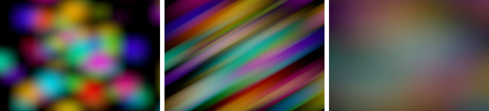](TriangleBlurShader.html)

## UnpackDepthRGBAShader
[ type: O1 ]

A shader that assumes the frame contains RGBA encoded depth data and unpacks it into grayscale colors.
	
* **`opacity`** – shader effect opacity (float, 0.0 to 1.0, default value 1.0) 

Example: [UnpackDepthRGBAShader.html](UnpackDepthRGBAShader.html)
		

## VerticalBlurShader
[ type: O9 ]

A shader that blurs the frame vertically with a Gaussian blur filter.
	
* **`resolution`** – canvas height (float, default value innerHeight)
* **`amount`** – amount of shader effect (float, default value 1.0) 

Example: [VerticalBlurShader.html](VerticalBlurShader.html)
		

*Notes: (1) **h** is renamed to **resolution**,
it is not 1/*height* and has another default value; (2) **amount** is added.*

## VerticalTiltShiftShader
[ type: O9 ]

A shader that fakes a vertical tilt-shift effect, i.e. the areas to the left and right of a vertical area are blured.
	
* **`position`** – horizontal position of the vertical area (float, in NDC space units from 0 to 1, default value 0.5)
* **`span`** – the horizontal size of the vertical area (float, in NDC space units from 0 to 0.5, default value 0.1)
* **`amount`** – amount of blur effect (float, from 0 to 10, default value 1.0) 

Example: [VerticalTiltShiftShader.html](VerticalTiltShiftShader.html)
		
[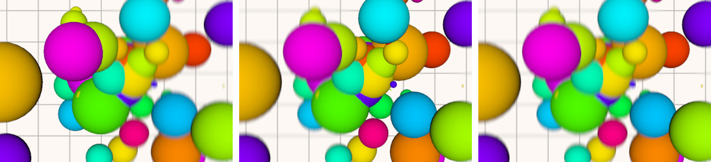](VerticalTiltShiftShader.html)

*Notes: (1) entirely different parameters; (2) entirely different calculation of blurred areas.*

## VignetteShader
[ type: O1 ]

A shader that adds a vignette effect on the frame.
	
* **`radius`** – internal vignette radius (float, in NDC space units, default value 1.0)
* **`blur`** – amount of blur effect on vignette border (float, 0 for no blur, default value 1.0) 
* **`color`** – vignette color (color, default value THREE.Color(0,0,0) for black color) 

Example: [VignetteShader.html](VignetteShader.html)
		
[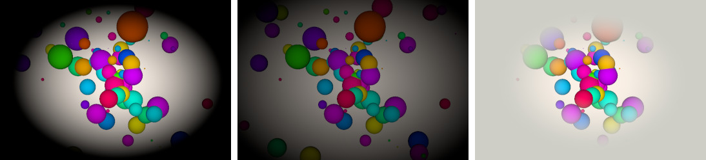](VignetteShader.html)

*Notes: (1) the shader is written from scratch
and is unrelated with the Three.js VignetteShader.*
