# Effects Gallery

This page is a showcase of individual effects. They can be
used to pick a desired effect and to play with its parameters.

A
[ACESFilmicToneMapping](#acesfilmictonemapping)
&middot; [AfterimagePass](#afterimagepass)
B
[Basic](#basic)
&middot; [BleachBypass](#bleachbypass)
&middot; Blend
&middot; [Bokeh](#bokeh)
&middot; Bokeh2
&middot; [BrightnessContrast](#brightnesscontrast)
C
[ColorCorrection](#colorcorrection)
&middot; [Colorify](#colorify)
&middot; [ColorifyX](#colorifyx)
&middot; [Convolution](#convolution)
&middot; [Copy](#copy)
D
DepthLimitedBlur
&middot; DigitalGlitch
&middot; DOFMipMap
&middot; [DotScreen](#dotscreen)
&middot; [DotScreenX](#dotscreenx)
E
[Exposure](#exposure)
&middot; [ExposureX](#exposurex)
F
[Film](#film)
&middot; [FilmX](#filmx)
&middot; [Focus](#focus)
&middot; [FreiChen](#freichen)
&middot; [FXAA](#fxaa)
G
[GammaCorrection](#gammacorrection)
&middot; GodRays
H
[Halftone](#halftone)
&middot; [HorizontalBlur](#horizontalblur)
&middot; [HorizontalBlurX](#horizontalblurx)
&middot; [HorizontalTiltShift](#horizontaltiltshift)
&middot; [HorizontalTiltShiftX](#horizontaltiltshiftx)
&middot; [HueSaturation](#huesaturation)
K
[Kaleido](#kaleido)
&middot; [KaleidoX](#kaleidox)
L
[LuminosityHighPass](#luminosityhighpass)
&middot; [Luminosity](#luminosity)
M
[Mirror](#mirror)
&middot; MMDToon
&middot; [MotionBlurPassX](#motionblurpass-x)
N
NormalMap
O
Output
R
[RGBShift](#rgbshift)
S
SAO
&middot; [Sepia](#sepia)
&middot; SMAA
&middot; [SobelOperator](#sobeloperator)
&middot; SSAO
&middot; SSR
&middot; SubsurfaceScattering
T
[Technicolor](#technicolor)
&middot; [TechnicolorX](#technicolorx)
&middot; Toon
&middot; [TriangleBlur](#triangleblur)
U
[UnpackDepthRGBA](#unpackdepthrgba)
V
Velocity
&middot; [VerticalBlur](#verticalblur)
&middot; [VerticalBlurX](#verticalblurx)
&middot; [VerticalTiltShift](#verticaltiltshift)
&middot; [VerticalTiltShiftX](#verticaltiltshiftx)
&middot; [Vignette](#vignette)
&middot; [VignetteX](#vignettex)
&middot; Volume
W
WaterRefraction

## ACESFilmicToneMapping

This effect applies filmic tonemap to the frame as defined
by the Academy Color Encoding System.
	
* **`exposure`** – exposure factor (float, from 0 to 1, default value 1) 

Example: [ACESFilmicToneMapping.html](ACESFilmicToneMapping.html)
		
[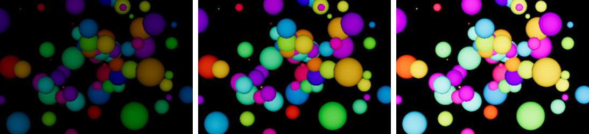](ACESFilmicToneMapping.html)
	

## Afterimage

This effect applies the frame onto cumulative image of older
versions of the frame, thus building an after image effect.
The effect is similar to [MotionBlurX](#motionblurx).
	
* **`damp`** – damping factor, i.e. how much of the old frame to use (float, from 0 to 1, default value 0.96) 

Example: [Afterimage.html](Afterimage.html)
		

	

## Basic

This effect fills the frame with red color with 50% opacity.
It is intended as a template for more complex effects.
	
* *no parameters*

Example: [Basic.html](Basic.html)
		
[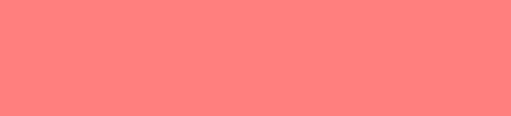](Basic.html)

## BleachBypass

This effects implements the [bleach bypass](https://en.wikipedia.org/wiki/Bleach_bypass)
effect in photography.
	
* **`amount`** – amount of effect intensity (float, from 0, default value 1)

Example: [BleachBypass.html](BleachBypass.html)
		
[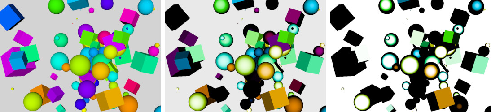](BleachBypass.html)

## Bokeh

This effects implements the out-of-focus [bokeh](https://en.wikipedia.org/wiki/Bokeh)
effect in photography. Objects at focal distance appear sharp, while closer
objects or objects further away are blurred with a circuler pattern. The size of
the focused area, known as [depth of field](https://en.wikipedia.org/wiki/Depth_of_field)
(DOF) depends on the lens [aperture](https://en.wikipedia.org/wiki/Aperture). Higher
aperture shrinks DOF, so a tiny slice of the space is on focus.
		
* **`focus`** – focal distance to the camera (float, from 0, default value 1)
* **`aperture`** – lens aperture (float, from 0 to 0.00010, default value 0.025, which is extremely large)
* **`maxblur`** – maximal level of blur effect (float, from 0 to 0.5, default value 0.015)

Example: [Bokeh.html](Bokeh.html)
		
[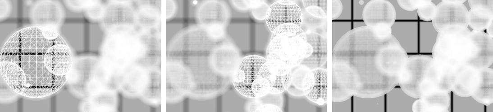](Bokeh.html)

## BrightnessContrast

This effect changes the brightness and the contract of a frame.
	
* **`brightness`** – amount of color brightness (float, from -1 to 1, default value 0)
* **`contrast`** – amount of color contrast (float, from -1 to 1, default value 0)

Example: [BrightnessContrast.html](BrightnessContrast.html)
		
[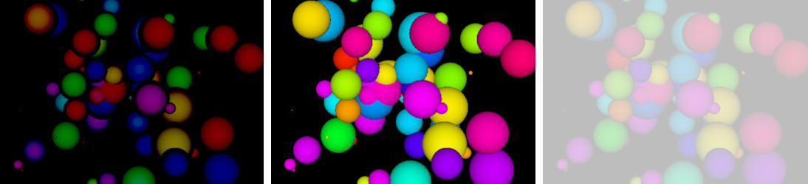](BrightnessContrast.html)
		

## ColorCorrection

This effect transforms the colors in a frame by *m*&times;(*color* + *a*)*p*.
Each color component is transformed by its own factors *m*, *a* and *p*.
	
* **`mulRGB`** – scaling factor *m* (vector, default value THREE.Vector3(1,1,1))
* **`addRGB`** – offset factor *a* (vector, default value THREE.Vector3(0,0,0))
* **`powRGB`** – power factor *p* (vector, default value THREE.Vector3(2,2,2))

Example: [ColorCorrection.html](ColorCorrection.html)
		

## Colorify

This effect converts the colors of the frame into specific
color. For an alternative version of this effect see
[ColorifyX](#colorifyx).
	
* **`color`** – target color (color, default value THREE.Color(1,1,1) for white color) 

Example: [Colorify.html](Colorify.html)
		
[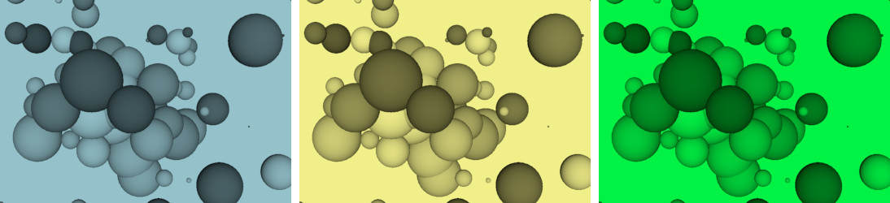](Colorify.html)

## ColorifyX

This effect converts the colors of the frame into specific
color. It extends the [Colorify](#colorify) by adding `opacity`.
	
* **`color`** – target color (color, default value THREE.Color(1,1,1) for white color) 
* **`opacity`** – opacity of colorification (float, from 0 to 1, default value 1 for full colorification) 

Example: [ColorifyX.html](ColorifyX.html)
		
[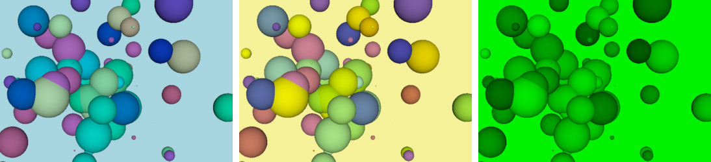](ColorifyX.html)

## Convolution

This effect applies 1D convolution to the colors of the
frame. Convolution is used to implement blur, sharpen, edge
detection and other filters, based on a kernel. The
[kernel](https://en.wikipedia.org/wiki/Kernel_(image_processing))
is an array of 25 floats.
	
* **`uImageIncrement`** – sampling points increment (vector, default value THREE.Vector2(0,0)) 
* **`cKernel`** – convolution kernel (array float[25], default values for Gauss blur) 

Example: [Convolution.html](Convolution.html)
		

	

## Copy

This effect just copies the frame multiplying each color
with opacity factor.
	
* **`opacity`** – opacity factor (float, from 0 to 1, default value 1) 

Example: [Copy.html](Copy.html)
		

## DotScreen

This effect converts the frame into regularly spread dots.
For an alternative version of this effect see
[DotScreenX](#dotscreenx).
	
* **`scale`** – scale factor of dots size in the pattern (float, default value 1, larger values reduce dot size)
* **`angle`** – angle of the pattern (float, default value 1.57)
* **`center`** – center of the pattern (vector, default value THREE.Vector2(0.5,0.5))

Example: [DotScreen.html](DotScreen.html)
		
[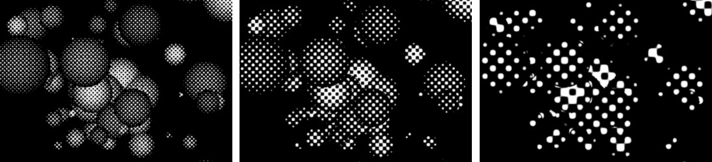](DotScreen.html)

## DotScreenX

This effect converts the frame into regularly spread dots.
It extends the [DotScreen](#dotscreen) by assuming ascending
orientation of `scale` and adding `opacity`.
	
* **`scale`** – size of the dots in the pattern (float, default value 1, larger values increase dot size)
* **`angle`** – angle of the pattern (float, default value 1.57)
* **`center`** – center of the pattern (vector, default value THREE.Vector2(0.5,0.5))
* **`opacity`** – effect opacity (float, from 0 to 1, default value 1) 

Example: [DotScreenX.html](DotScreenX.html)
		
[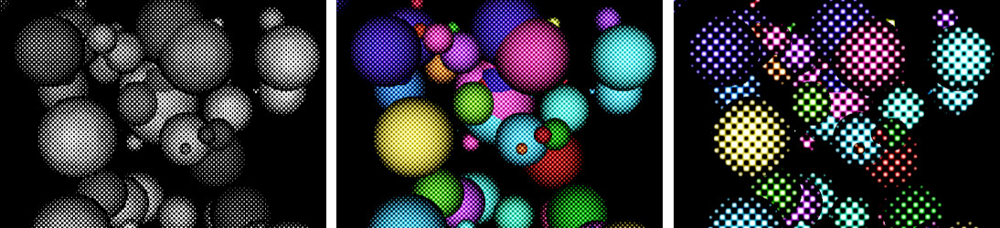](DotScreenX.html)

## Exposure

This effect changes the exposure of a frame by myltiplying
colors by factor *f*. Exposure factor *f*&lt;1 makes the
colors darker, while exposure *f*&gt;1 makes them brighter.
Exposure is multiplicative, i.e. the black color does not
change the frame and the 'opposite' of *f*=2 is *f*=1/2.
For an alternative version of this effect see [ExposureX](#exposurex).
	
* **`exposure`** – exposure factor (float, default value 1)

Example: [Exposure.html](Exposure.html)
		
[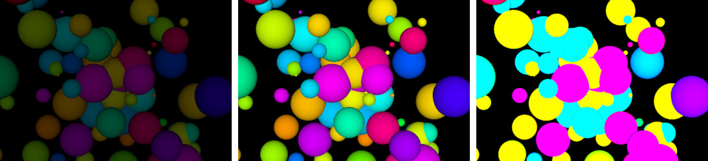](Exposure.html)

## ExposureX

This effect changes the exposure of a frame by myltiplying
colors by factor *ef*, where *e*&approx;2.718 is
the [Euler's number](https://en.wikipedia.org/wiki/E_(mathematical_constant)).
Exposure factor *f*&lt;0 makes the colors darker, while
exposure *f*&gt;0 makes them brighter. Exposure is linear,
i.e. the 'opposite' of *f*=2 is *f*=-2. This effect is an 
alternative to [Exposure](#exposure).
	
* **`exposure`** – exposure factor (float, default value 0)

Example: [ExposureX.html](ExposureX.html)
		
[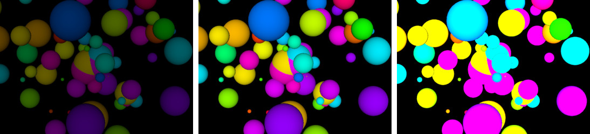](ExposureX.html)

## Film

This effect adds graininess to the frame. For an alternative
version see [FilmX](#filmx).
	
* **`intensity`** – intensity of graininess (float, from 0 to 3, default value 0.5) 
* **`grayscale`** – a flag whether to convert the colors to grayscale (boolean, default value false) 

Example: [Film.html](Film.html)
		
[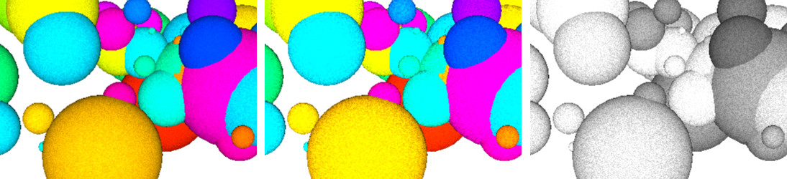](Film.html)

## FilmX

This effect adds stronger graininess to the frame. It is an
alternative to [Film](#film).
	
* **`intensity`** – intensity of graininess (float, from 0 to 3, default value 0.5) 
* **`grayscale`** – a flag whether to convert the colors to grayscale (boolean, default value false) 

Example: [FilmX.html](FilmX.html)
		
[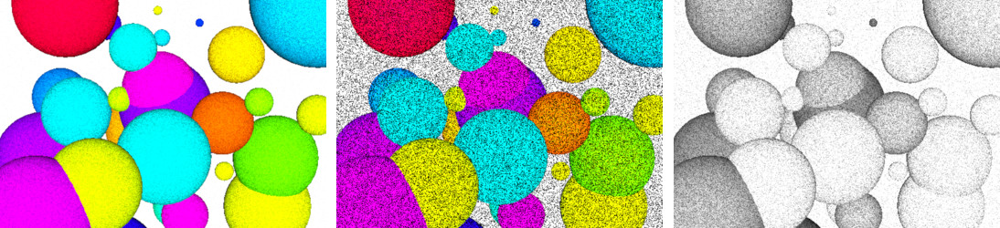](FilmX.html)

## Focus

This effect blurs the frame by keeping the center more focused.
	
* **`sampleDistance`** – non-linear component of the blur effect (float, 0 to 2, default value 0.94)
* **`waveFactor`** – linear component of the blur effect (float, 0 to 0.02, default value 0.00125)

Example: [Focus.html](Focus.html)
		

## FreiChen

This effect marks the edges of shapes based on the Frei-Chen
edge detection algorithm.
	
Example: [FreiChen.html](FreiChen.html)
		
[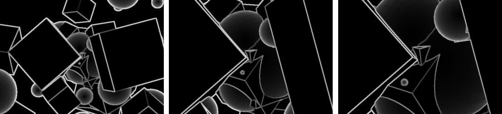](FreiChen.html)

## FXAA

This effect implements a variation of the
[FXAA (Fast approximate anti-aliasing)](https://en.wikipedia.org/wiki/Fast_approximate_anti-aliasing) screen-space anti-aliasing.
	
* *no parameters*

Example: [FXAA.html](FXAA.html)
		
[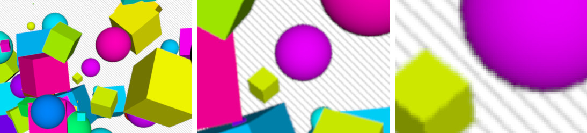](FXAA.html)

## GammaCorrection

This effect applies sRGB electro-optical transfer function
(EOTF), which is approximation of &gamma;=2.2. 
	
* *no parameters*

Example: [GammaCorrection.html](GammaCorrection.html)
		
[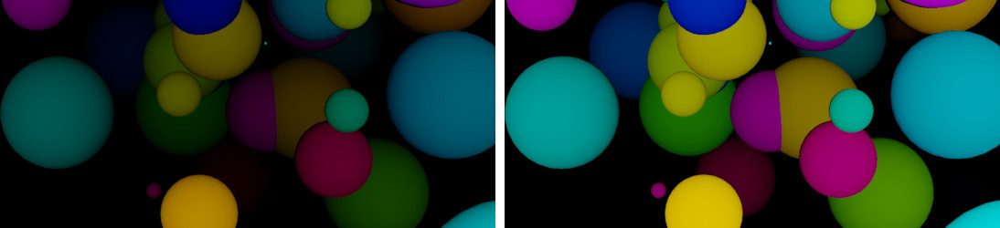](GammaCorrection.html)

## Halftone

This effect converts the colors in the frame into
[overlapping single-color patterns](https://en.wikipedia.org/wiki/Halftone)
of shapes. 

* **`shape`** – pattern shape, (int, from 1 to 4, default value 1 for dot)
	<small>  &nbsp; &nbsp; 1 = dot
	  &nbsp; &nbsp; 2 = ellipse
	  &nbsp; &nbsp; 3 = line
	  &nbsp; &nbsp; 4 = square</small>
* **`radius`** – size of the pattern shapes (float, from 1 to 20, default value 4)
* **`scatter`** – amount of pattern distortion (float, from 0 to 10, default value 0),
* **`rotateR`** – rotation of red color patterns (float, from 0 to 2&pi;, default value  &pi;/12 which correponds to 15&deg;)
* **`rotateG`** – rotation of green color patterns (float, from 0 to 2&pi;, default value  2&pi;/12 which correponds to 30&deg;)
* **`rotateB`** – rotation of blue color patterns (float, from 0 to 2&pi;, default value  3&pi;/12 which correponds to 45&deg;)
* **`blending`** – blending strength/opacity (float, from 0 to 1, default value 1)
* **`blendingMode`** – defines how the halftone image is blended with the original frame (int, from 1 to 5, default value 1 for linear)
	<small>  &nbsp; &nbsp; 1 = linear
	  &nbsp; &nbsp; 2 = multiply
	  &nbsp; &nbsp; 3 = add
	  &nbsp; &nbsp; 4 = lighter
	  &nbsp; &nbsp; 5 = darker</small>
* **`greyscale`** - flag for grayscale effect (boolean, default value *false*) &ndash; note: "grey", not "gray"
* **`disable`** - flag for disabling the effect (boolean, default value *false*)

Example: [Halftone.html](Halftone.html)
		
[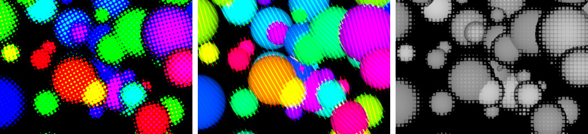](Halftone.html)

## HorizontalBlur

This effect blurs the frame horizontally with a fixed
Gaussian blur filter. For a variable filter see
[HorizontalBlurX](#horizontalblurx).
	
Example: [HorizontalBlur.html](HorizontalBlur.html)
		
[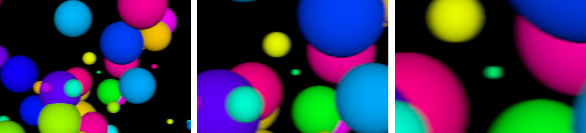](HorizontalBlur.html)

## HorizontalBlurX

This effect blurs the frame horizontally with a variable
Gaussian blur filter by using the same number of samplings,
but at different span. For a fixed filter at *amount*=1 see
[HorizontalBlur](#horizontalblur).
	
* **`amount`** – amount of effect (float, default value 1) 

Example: [HorizontalBlurX.html](HorizontalBlurX.html)
		
[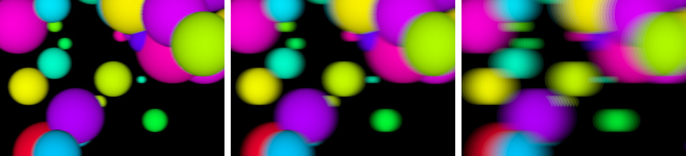](HorizontalBlurX.html)

## HorizontalTiltShift

This effect makes the horizontal blur of a tilt-shift effect
similar to the
[miniature faking](https://en.wikipedia.org/wiki/Miniature_faking) in [tilt-shift photography](https://en.wikipedia.org/wiki/Tilt–shift_photography#Miniature_faking).
Both horizontal blur and vertical blur (see [VerticalTiltShift](#verticaltiltshift))
are required for a full tilt-shift effect. For an alternative
implementation of the horizontal blur effect with different
parameters see [HorizontalTiltShiftX](#horizontaltiltshiftx).
	
* **`r`** – position of the focus area (float, in NDC space units from 0 to 1, default value 0.35)

Example: [HorizontalTiltShift.html](HorizontalTiltShift.html)
		
[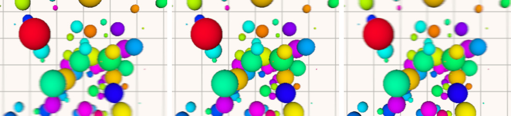](HorizontalTiltShift.html)

## HorizontalTiltShiftX

This effect makes the horizontal blur of a tilt-shift effect
similar to the miniature faking in tilt-shift photography.
Both horizontal blur and vertical blur (see [VerticalTiltShiftX](#verticaltiltshiftx))
are required for a full tilt-shift effect. For an alternative
implementation of the horizontal blur effect with different
parameters see [HorizontalTiltShift](#horizontaltiltshift).

	
* **`position`** – position of the focus area (float, in NDC space units from 0 to 1, default value 0.5)
* **`span`** – size of the focus area (float, in NDC space units from 0 to 0.5, default value 0)
* **`amount`** – amount of blur effect (float, from 0 to 10, default value 1.5) 

Example: [HorizontalTiltShiftX.html](HorizontalTiltShiftX.html)
		
[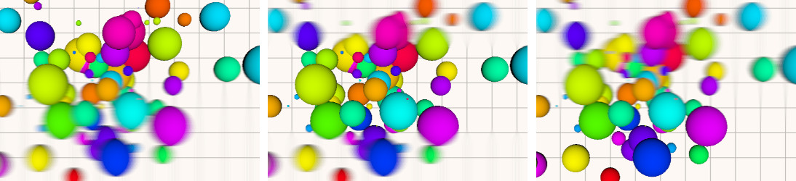](HorizontalTiltShiftX.html)

## HueSaturation

This effect changes the [hue](https://en.wikipedia.org/wiki/Hue)
(the colorness of colors, like *red*, *green* or *yellow*)
and the [saturation](https://en.wikipedia.org/wiki/Colorfulness#Saturation)
(the colorfulness or strength of colors, line *gray* or
*colorful*) of a frame.
	
* **`hue`** – relative change of hue (float, from -1 to 1, default value 0)
* **`saturation`** – relative change of saturation (float, from -1 to 1, default value 0)

Example: [HueSaturation.html](HueSaturation.html)
		
[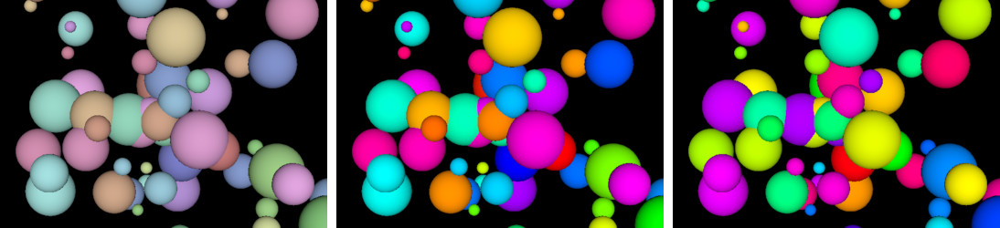](HueSaturation.html)

## Kaleido

This effect mirrors a pie fragment of the frame into a
[kaleidoscopic](https://en.wikipedia.org/wiki/Kaleidoscope)
image. For an aspect-friendly alternative of this effect see
[KaleidoX](#kaleidox).
	
* **`sides`** – number of side of the kaleidoscope image (int, 3 or more, default value 6)
* **`angle`** – rotation of the kaleidoscope image in radians (float, default value 0)

Example: [Kaleido.html](Kaleido.html)
		
[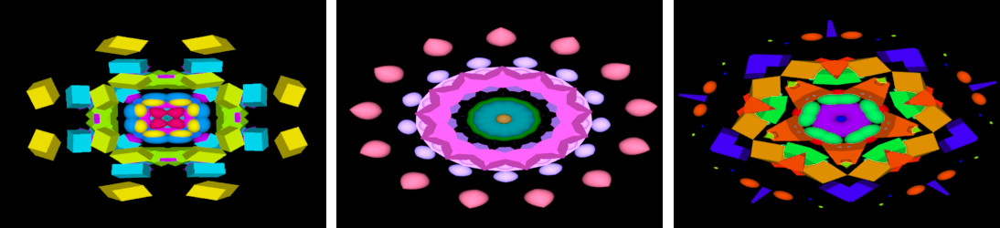](Kaleido.html)

## KaleidoX

This effect mirrors a pie fragment of the frame into a
kaleidoscopic image. For a non-aspect alternative of this
effect see [Kaleido](#kaleido).
	
* **`sides`** – number of side of the kaleidoscope image (int, 3 or more, default value 6)
* **`angle`** – rotation of the kaleidoscope image in radians (float, default value 0)

Example: [KaleidoX.html](KaleidoX.html)
		
[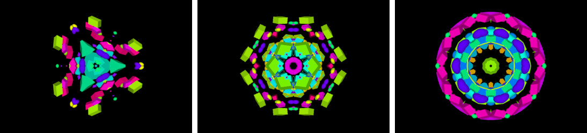](KaleidoX.html)

## LuminosityHighPass

This effect changes a frame by blending colors based on
their luminocity. In contrast to the [Luminosity](#luminosity),
this effect calculates the luminocity as &approx;30% (red),
&approx;59% (green) and &approx;11%(blue).
	
* **`defaultColor`** – default color to blend to (color, default value THREE.Color(0,0,0)) 
* **`defaultOpacity`** – alpha component of the default color (float, from 0 to 1, default value 0) 
* **`luminosityThreshold`** – minimal luminocity for blending (float, from -1 to 1, default value 1) 
* **`smoothWidth`** – blending span, i.e. it is applied for luminocities from *threshold-smoothWidth* to *threshold+smoothWidth* (float, from -1 to 1, default value 1) 

Example: [LuminosityHighPass.html](LuminosityHighPass.html)
		
[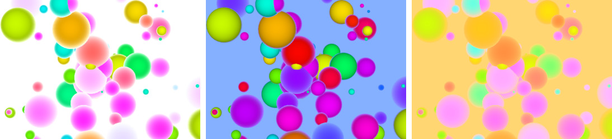](LuminosityHighPass.html)
		

## Luminosity

This effect converts colors of a frame to grayscale based on
luminocity, i.e. color components contribute with their
different factors: &approx;21% (red), &approx;72% (green)
and &approx;7%(blue). A more advanced lunimosity effect is
[LuminosityHighPass](#luminosityhighpass).
	
* *no parameters*

Example: [Luminosity.html](Luminosity.html)
		
[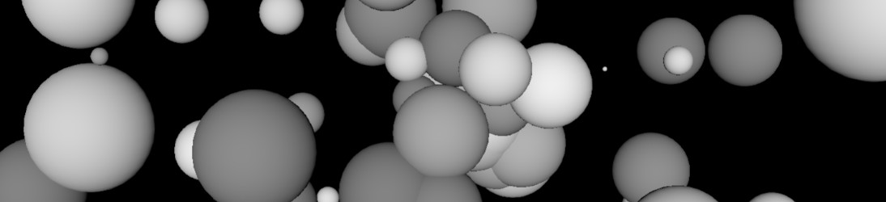](Luminosity.html)

## Mirror

This effect mirrors half of the frame onto the other half.
	
* **`side`** – which half frame is the source of mirror (int, from 0 to 3, default value 1)
	<small>  &nbsp; &nbsp; 0 = left&rarr;right
	  &nbsp; &nbsp; 1 = right&rarr;left
	  &nbsp; &nbsp; 2 = top&rarr;bottom
	  &nbsp; &nbsp; 3 = bottom&rarr;top</small>

Example: [Mirror.html](Mirror.html)
		
[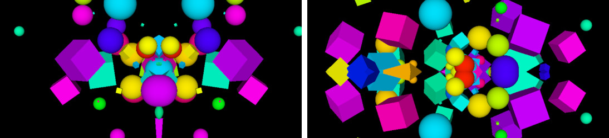](Mirror.html)

		

## MotionBlurX

This effect applies the frame onto cumulative image of older
versions of the frame, thus building a motion blur. The
effect is similar to [Afterimage](#afterimage).
	
* **`damp`** – damping factor, i.e. how much of the old frame to use (float, from 0 to 1, default value 0.9) 

Example: [MotionBlurX.html](MotionBlurX.html)
		
[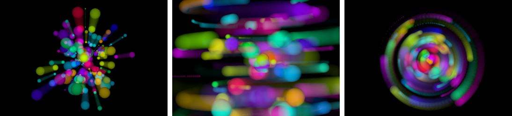](MotionBlurX.html)

## RGBShift

This effect splits the RGB color components of the frame and
shifts them apart.

* **`amount`** – amount of shift (float, in NDC space units, default value 0.005)
* **`angle`** – angle of offset (float, in radians, default value 0.0)

Example: [RGBShift.html](RGBShift.html)
		
[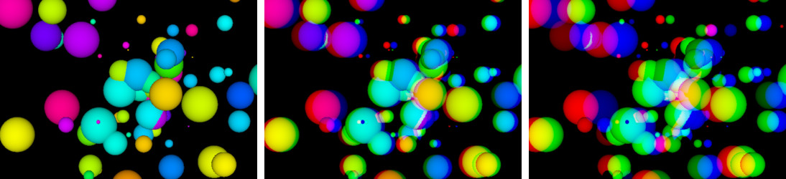](RGBShift.html)

## Sepia

This effect recolors the frame into [sepia color](https://en.wikipedia.org/wiki/Sepia_(color)).

* **`amount`** – amount of recoloring (float, from 0 to 1, default value 1)

Example: [Sepia.html](Sepia.html)
		

		

## SobelOperator

This effect applies a [Sobel operator](https://en.wikipedia.org/wiki/Sobel_operator)
on a frame and detects the edges of shapes based on the red
color component.
	
* *no parameters*

Example: [SobelOperator.html](SobelOperator.html)
		

## Technicolor

This effect converts the colors of the frame into
[Technicolor cyan-red hues](https://en.wikipedia.org/wiki/Technicolor#Two-color_Technicolor).
For an altenative version see [TechnicolorX](#technicolorx).
	
* *no parameters*

Example: [Technicolor.html](Technicolor.html)
		
[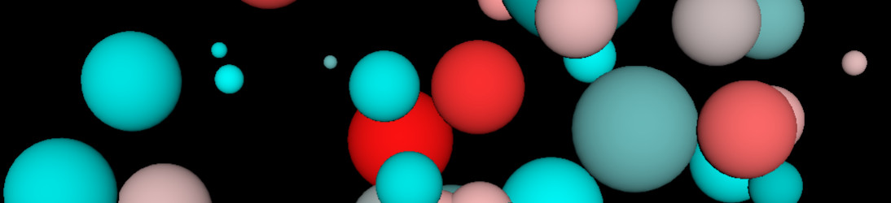](Technicolor.html)

## TechnicolorX

This effect converts the colors of the frame into Technicolor
cyan-red. It extends the [Technicolor](#technicolor) by
adding `amount`.
	
* **`amount`** – amount of recoloring (float, from 0 to 1, default value 1)

Example: [TechnicolorX.html](TechnicolorX.html)
		

## TriangleBlur

This effect blurs the frame using randomized weighted
samples. The blur is biased along a direction.
	
* **`amount`** – amount of effect in both directions (vector, components in NDC space units from 0 to 1, default value THREE.Vector2(0,0)) 

To use this effect for a non-biased blur, it must be applied
twice: a horizontal blur (e.g. *amount*=(0.1,0)) and a
vertical blur (e.g. *amount*=(0,0.1)).

Example: [TriangleBlur.html](TriangleBlur.html)
		
[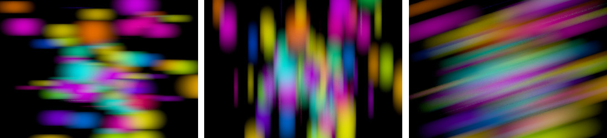](TriangleBlur.html)

## UnpackDepthRGBA

This effect assumes the frame contains RGBA encoded depth
data and unpacks it into grayscale colors.
	
* **`opacity`** – effect opacity (float, from 0 to 1, default value 1) 

Example: [UnpackDepthRGBA.html](UnpackDepthRGBA.html)
		

## VerticalBlur

This effect blurs the frame vertically with a fixed Gaussian
blur filter. For a variable filter see [VerticalBlurX](#verticalblurx).
	
Example: [VerticalBlur.html](VerticalBlur.html)
		
[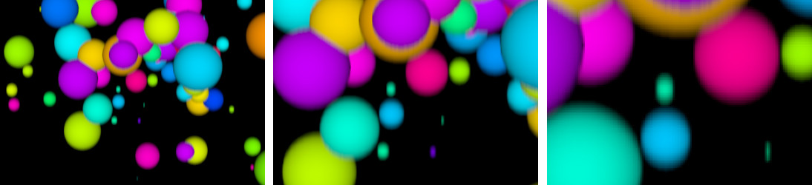](VerticalBlur.html)

## VerticalBlurX

This effect blurs the frame vertically with a variable
Gaussian blur filter by using the same number of samplings,
but at different span. For a fixed filter at *amount*=1 see
[VerticalBlur](#verticalblur).
	
* **`amount`** – amount of effect (float, default value 1) 

Example: [VerticalBlurX.html](VerticalBlurX.html)
		
[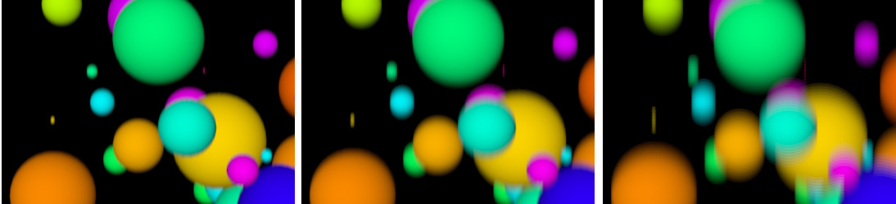](VerticalBlurX.html)

## VerticalTiltShift

This effect makes the vertical blur of a tilt-shift effect
similar to the [miniature faking](https://en.wikipedia.org/wiki/Miniature_faking) in [tilt-shift photography](https://en.wikipedia.org/wiki/Tilt–shift_photography#Miniature_faking).
Both horizontal blur (see [HorizontalTiltShift](#horizontaltiltshift))
and vertical blur are required for a full tilt-shift effect.
For an alternative implementation of the vertical blur
effect with different parameters see [VerticalTiltShiftX](#verticaltiltshiftx).
	
* **`r`** – position of the focus area (float, in NDC space units from 0 to 1, default value 0.35)

Example: [VerticalTiltShift.html](VerticalTiltShift.html)
		
[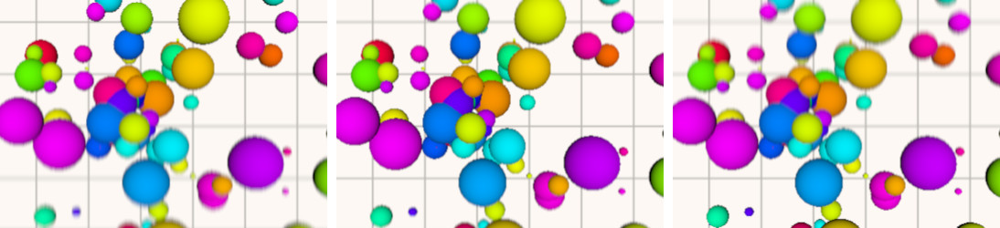](VerticalTiltShift.html)

## VerticalTiltShiftX

This effect makes the vertical blur of a tilt-shift effect
similar to the miniature faking in tilt-shift photography.
Both horizontal blur (see [HrizontalTiltShiftX](#horizontaltiltshiftx))
and vertical blur are required for a full tilt-shift effect.
For an alternative implementation of the horizontal blur
with different parameters see [VerticalTiltShift](#verticaltiltshift).

	
* **`position`** – position of the focus area (float, in NDC space units from 0 to 1, default value 0.5)
* **`span`** – size of the focus area (float, in NDC space units from 0 to 0.5, default value 0)
* **`amount`** – amount of blur effect (float, from 0 to 10, default value 1.5) 

Example: [VerticalTiltShiftX.html](VerticalTiltShiftX.html)
		
[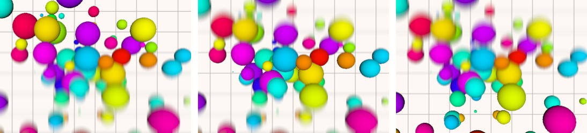](VerticalTiltShiftX.html)

## Vignette

This effect adds a [vignette effect](https://en.wikipedia.org/wiki/Vignetting)
on the frame. For an alternative implementation with
different parameters see [VignetteX](#vignettex).
	
* **`offset`** – relative inward distance (float, from 0 to 5, default value 1), larger values shrink the vignette oval
* **`darkness`** – amount of intensity reduction (float, from -5 to 5, default value 1), negative values brightens the frame, positive values darkens the frame

Example: [Vignette.html](Vignette.html)
		
[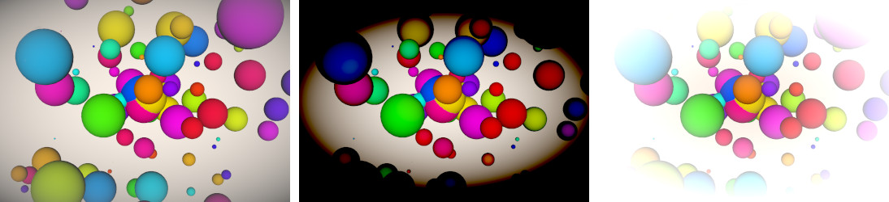](Vignette.html)

## VignetteX

This effect adds a vignette effect on the frame. For an
alternative implementation with different parameters see
[Vignette](#vignette).
	
* **`radius`** – relative outward vignette radius (float, in NDC space units, default value 1)
* **`blur`** – amount of blur effect on vignette border (float, 0 for no blur, default value 1) 
* **`color`** – vignette color (color, default value THREE.Color(0,0,0) for black color) 

Example: [VignetteX.html](VignetteX.html)
		
[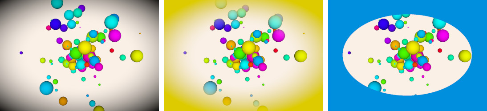](VignetteX.html)
