# Effects Gallery

This page is a showcase of individual effects. They can be
used to pick a desired effect and to play with its parameters.
The X-shaders are alternative Three.js shaders with fix issues,
extended functionality or are completely new.

A
[ACESFilmicToneMappingShader](#acesfilmictonemappingshader)
<!--
&middot; [AfterimageShader](#afterimageshader)
-->
B
[BasicShader](#basicshader)
&middot; [BleachBypassShader](#bleachbypassshader)
&middot; BlendShader
&middot; BokehShader
&middot; BokehShader2
&middot; [BrightnessContrastShader](#brightnesscontrastshader)
C
[ColorCorrectionShader](#colorcorrectionshader)
&middot; [ColorifyShader](#colorifyshader)
&middot; [ColorifyShader X](#colorifyshader-x)
&middot; [ConvolutionShader](#convolutionshader)
&middot; [CopyShader](#copyshader)
D
DepthLimitedBlurShader
&middot; DigitalGlitch
&middot; DOFMipMapShader
&middot; [DotScreenShader](#dotscreenshader)
&middot; [DotScreenShader X](#dotscreenshader-x)
E
[ExposureShader](#exposureshader)
&middot; [ExposureShader X](#exposureshader-x)
F
[FilmShader](#filmshader)
&middot; [FilmShader X](#filmshader-x)
&middot; [FocusShader](#focusshader)
&middot; [FreiChenShader](#freichenshader)
&middot; [FXAAShader](#fxaashader)
G
[GammaCorrectionShader](#gammacorrectionshader)
&middot; GodRaysShader
H
[HalftoneShader](#halftoneshader)
&middot; [HorizontalBlurShader](#horizontalblurshader)
&middot; [HorizontalBlurShader X](#horizontalblurshader-x)
&middot; [HorizontalTiltShiftShader](#horizontaltiltshiftshader)
&middot; [HorizontalTiltShiftShader X](#horizontaltiltshiftshader-x)
&middot; [HueSaturationShader](#huesaturationshader)
K
[KaleidoShader](#kaleidoshader)
&middot; [KaleidoShader X](#kaleidoshader-x)
L
[LuminosityHighPassShader](#luminosityhighpassshader)
&middot; [LuminosityShader](#luminosityshader)
M
[MirrorShader](#mirrorshader)
&middot; MMDToonShader
<!--
&middot; [MotionBlurShader](#motionblurshader)
-->
&N
NormalMapShader
O
OutputShader
R
[RGBShiftShader](#rgbshiftshader)
S
SAOShader
&middot; [SepiaShader](#sepiashader)
&middot; SMAAShader
&middot; [SobelOperatorShader](#sobeloperatorshader)
&middot; SSAOShader
&middot; SSRShader
&middot; SubsurfaceScatteringShader
T
[TechnicolorShader](#technicolorshader)
&middot; [TechnicolorShader X](#technicolorshader-x)
&middot; ToonShader
&middot; [TriangleBlurShader](#triangleblurshader)
U
[UnpackDepthRGBAShader](#unpackdepthrgbashader)
V
VelocityShader
&middot; [VerticalBlurShader](#verticalblurshader)
&middot; [VerticalBlurShader X](#verticalblurshader-x)
&middot; [VerticalTiltShiftShader](#verticaltiltshiftshader)
&middot; [VerticalTiltShiftShader X](#verticaltiltshiftshader-x)
&middot; [VignetteShader](#vignetteshader)
&middot; [VignetteShader X](#vignetteshader-x)
&middot; VolumeShader
W
WaterRefractionShader
<big style="color: Crimson">

## ACESFilmicToneMappingShader

A shader that applies filmic tonemap to the frame as defined
by the Academy Color Encoding System.
	
* **`exposure`** – exposure factor (float, from 0 to 1, default value 1) 

Example: [ACESFilmicToneMappingShader.html](ACESFilmicToneMappingShader.html)
		
[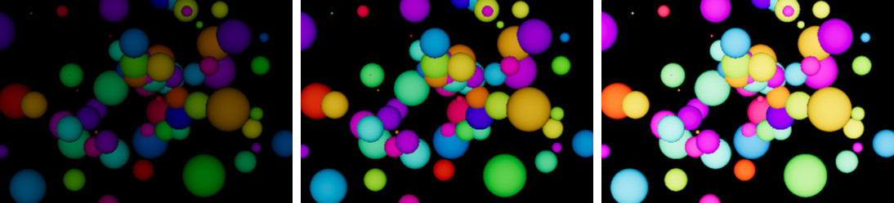](ACESFilmicToneMappingShader.html)
	

<!--
## AfterimageShader
[ type: S2 ]<big style="color: Crimson">

A shader that applies the frame onto cumulative image of older versions of the frame, thus
building an after image effect. This effect is similar to [MotionBlurShader](#motionblurshader).
	
* **`damp`** – damping factor, i.e. how much of the old frame to use (float, from 0 to 1, default value 0.96) 

Example: [AfterimageShader.html](AfterimageShader.html)
		
[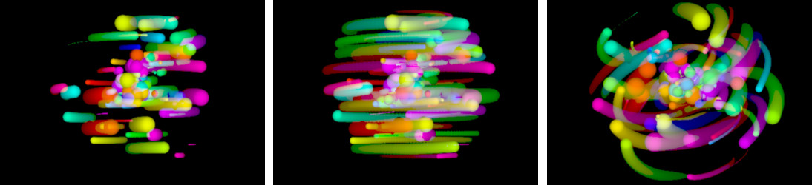](AfterimageShader.html)
-->	
	

## BasicShader

A basic and simple test shader that fills the frame with red color with 50% opacity.
	
* *no parameters*

Example: [BasicShader.html](BasicShader.html)
		
[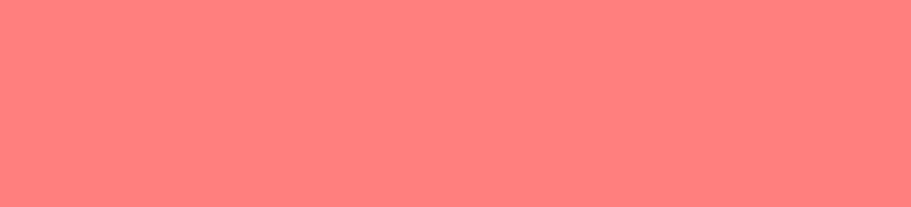](BasicShader.html)

## BleachBypassShader

A shader that applies the [bleach bypass](https://en.wikipedia.org/wiki/Bleach_bypass)
effect in photography.
	
* **`amount`** – amount of effect intensity (float, from 0, default value 1)

Example: [BleachBypassShader.html](BleachBypassShader.html)
		

## BrightnessContrastShader

A shader that changes the brightness and the contract of a frame.
	
* **`brightness`** – amount of color brightness (float, from -1 to 1, default value 0)
* **`contrast`** – amount of color contrast (float, from -1 to 1, default value 0)

Example: [BrightnessContrastShader.html](BrightnessContrastShader.html)
		

		

## ColorCorrectionShader

A shader that transforms the colors in a frame by *m*&times;(*color* + *a*)*p*.
Each color component is transformed by its own factors *m*, *a* and *p*.
	
* **`mulRGB`** – scaling factor *m* (vector, default value THREE.Vector3(1,1,1))
* **`addRGB`** – offset factor *a* (vector, default value THREE.Vector3(0,0,0))
* **`powRGB`** – power factor *p* (vector, default value THREE.Vector3(2,2,2))

Example: [ColorCorrectionShader.html](ColorCorrectionShader.html)
		
[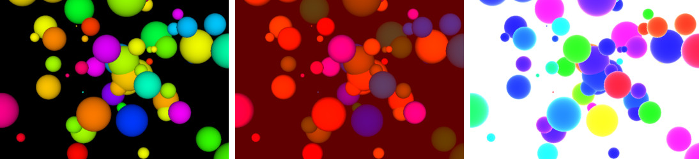](ColorCorrectionShader.html)

## ColorifyShader

A shader that converts the colors of the frame into specific color. For an
extended version of this shader see [ColorifyShader X](#colorifyshader-x).
	
* **`color`** – target color (color, default value THREE.Color(1,1,1) for white color) 

Example: [ColorifyShader.html](ColorifyShader.html)
		
[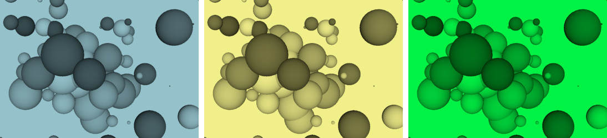](ColorifyShader.html)

## ColorifyShader X

A shader that converts the colors of the frame into specific color. It extends
the [ColorifyShader](#colorifyshader) by adding `opacity`.
	
* **`color`** – target color (color, default value THREE.Color(1,1,1) for white color) 
* **`opacity`** – opacity of colorification (float, from 0 to 1, default value 1 for full colorification) 

Example: [ColorifyShaderX.html](ColorifyShaderX.html)
		

## ConvolutionShader

A shader that applies 1D convolution to the colors of the frame. Convolution is
used to apply blur, sharpen, edge detection and other filters, based on a kernel. The
[kernel](https://en.wikipedia.org/wiki/Kernel_(image_processing)) is an array of
25 floats.
	
* **`uImageIncrement`** – sampling points increment (vector, default value THREE.Vector2(0,0)) 
* **`cKernel`** – convolution kernel (array float[25], default values for Gauss blur) 

Example: [ConvolutionShader.html](ConvolutionShader.html)
		
[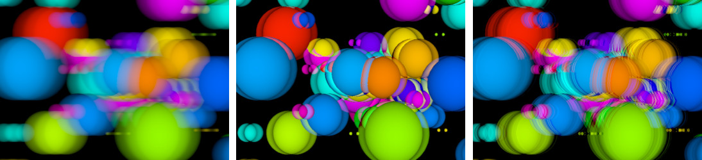](ConvolutionShader.html)
	

## CopyShader

A shader that just copies the frame multiplying each color with opacity factor.
	
* **`opacity`** – opacity factor (float, from 0 to 1, default value 1) 

Example: [CopyShader.html](CopyShader.html)
		
[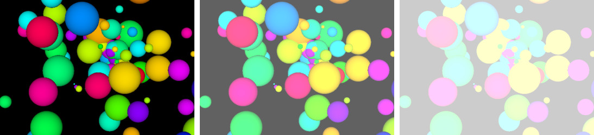](CopyShader.html)

## DotScreenShader

A shader that converts the frame into regularly spread dots. For an extended
version of this shader see [DotScreenShader X](#dotscreenshader-x).
	
* **`scale`** – scale factor of dots size in the pattern (float, default value 1, larger values reduce dot size)
* **`angle`** – angle of the pattern (float, default value 1.57)
* **`center`** – center of the pattern (vector, default value THREE.Vector2(0.5,0.5))

Example: [DotScreenShader.html](DotScreenShader.html)
		
[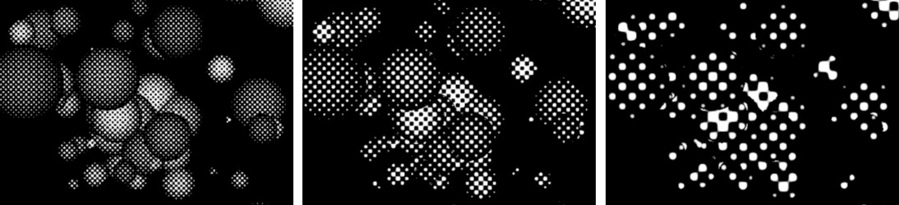](DotScreenShader.html)

## DotScreenShader X

A shader that converts the frame into regularly spread dots. It extends
the [DotScreenShader](#dotscreenshader) by assuming ascending orientation of
`scale` and adding `opacity`.
	
* **`scale`** – size of the dots in the pattern (float, default value 1, larger values increase dot size)
* **`angle`** – angle of the pattern (float, default value 1.57)
* **`center`** – center of the pattern (vector, default value THREE.Vector2(0.5,0.5))
* **`opacity`** – shader effect opacity (float, from 0 to 1, default value 1) 

Example: [DotScreenShaderX.html](DotScreenShaderX.html)
		
[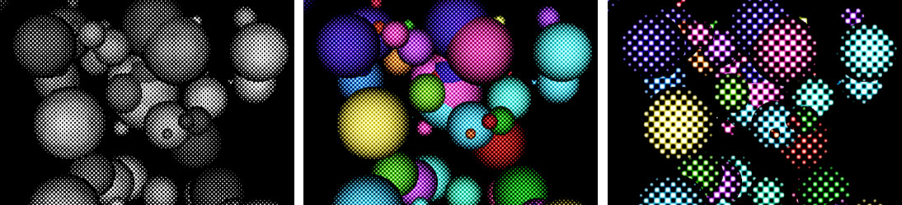](DotScreenShaderX.html)

## ExposureShader

A shader that changes the exposure of a frame by myltiplying colors by factor *f*.
Exposure factor *f*&lt;1 makes the colors darker, while exposure *f*&gt;1 makes
them brighter. Exposure is multiplicative, i.e. the black color does not change
the frame and the 'opposite' of *f*=2 is *f*=1/2. For an alternative
version of this shader see [ExposureShader X](#exposureshader-x).
	
* **`exposure`** – exposure factor (float, default value 1)

Example: [ExposureShader.html](ExposureShader.html)
		

## ExposureShader X

A shader that changes the exposure of a frame by myltiplying colors by factor
*ef*, where *e*&approx;2.718 is the
[Euler's number](https://en.wikipedia.org/wiki/E_(mathematical_constant)).
Exposure factor *f*&lt;0 makes the colors darker, while exposure *f*&gt;0 makes
them brighter. Exposure is linear, i.e. the 'opposite' of *f*=2 is *f*=-2. This
shader is an alternative to [ExposureShader](#exposureshader).
	
* **`exposure`** – exposure factor (float, default value 0)

Example: [ExposureShaderX.html](ExposureShaderX.html)
		
[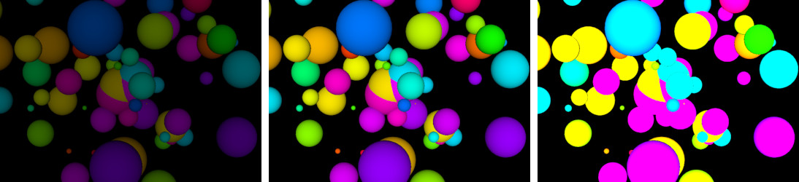](ExposureShaderX.html)

## FilmShader

A shader that adds graininess to the frame. For an alternative version of this
shader see [FilmShader X](#filmshader-x).
	
* **`intensity`** – intensity of graininess (float, from 0 to 3, default value 0.5) 
* **`grayscale`** – a flag whether to convert the colors to grayscale (boolean, default value false) 

Example: [FilmShader.html](FilmShader.html)
		
[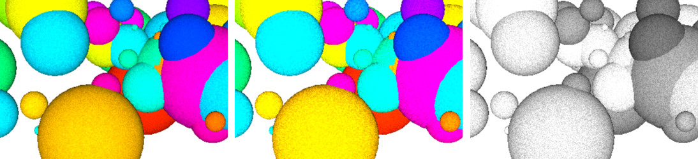](FilmShader.html)

## FilmShader X

A shader that adds stronger graininess to the frame. This shader is an alternative
to [FilmShader](#filmshader).
	
* **`intensity`** – intensity of graininess (float, from 0 to 3, default value 0.5) 
* **`grayscale`** – a flag whether to convert the colors to grayscale (boolean, default value false) 

Example: [FilmShaderX.html](FilmShaderX.html)
		
[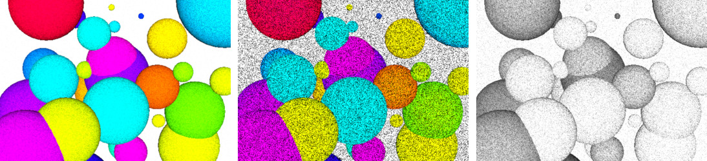](FilmShaderX.html)

## FocusShader

A shader that blurs the frame by keeping the center more focused.
	
* **`sampleDistance`** – non-linear component of the blur effect (float, 0 to 2, default value 0.94)
* **`waveFactor`** – linear component of the blur effect (float, 0 to 0.02, default value 0.00125)

Example: [FocusShader.html](FocusShader.html)
		
[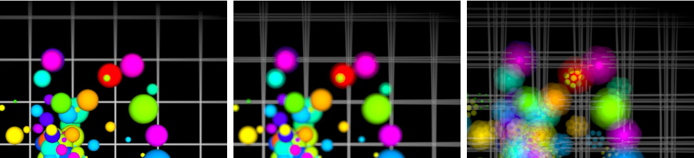](FocusShader.html)

## FreiChenShader
A shader that marks the edges of shapes based on the Frei-Chen edge detection
algorithm.
	
Example: [FreiChenShader.html](FreiChenShader.html)
		
[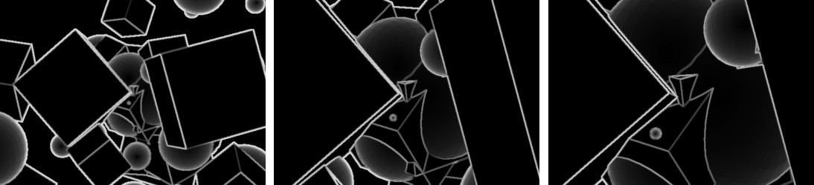](FreiChenShader.html)

## FXAAShader

A shader that implements a variation of the [FXAA (Fast approximate anti-aliasing)](https://en.wikipedia.org/wiki/Fast_approximate_anti-aliasing) screen-space anti-aliasing.
	
* *no parameters*

Example: [FXAAShader.html](FXAAShader.html)
		
[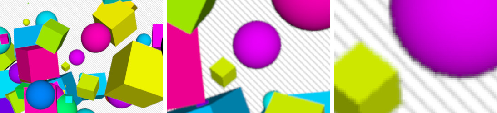](FXAAShader.html)

## GammaCorrectionShader

A shader that applies sRGB electro-optical transfer function (EOTF), which is
approximation of &gamma;=2.2. 
	
* *no parameters*

Example: [GammaCorrectionShader.html](GammaCorrectionShader.html)
		
[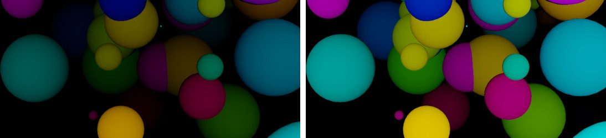](GammaCorrectionShader.html)

## HalftoneShader

A shader that converts the colors in the frame into [overlapping single-color patterns](https://en.wikipedia.org/wiki/Halftone) of shapes. 

* **`shape`** – pattern shape, (int, from 1 to 4, default value 1 for dot)
	<small>  &nbsp; &nbsp; 1 = dot
	  &nbsp; &nbsp; 2 = ellipse
	  &nbsp; &nbsp; 3 = line
	  &nbsp; &nbsp; 4 = square</small>
* **`radius`** – size of the pattern shapes (float, from 1 to 20, default value 4)
* **`scatter`** – amount of pattern distortion (float, from 0 to 10, default value 0),
* **`rotateR`** – rotation of red color patterns (float, from 0 to 2&pi;, default value  &pi;/12 which correponds to 15&deg;)
* **`rotateG`** – rotation of green color patterns (float, from 0 to 2&pi;, default value  2&pi;/12 which correponds to 30&deg;)
* **`rotateB`** – rotation of blue color patterns (float, from 0 to 2&pi;, default value  3&pi;/12 which correponds to 45&deg;)
* **`blending`** – blending strength/opacity (float, from 0 to 1, default value 1)
* **`blendingMode`** – defines how the halftone image is blended with the original frame (int, from 1 to 5, default value 1 for linear)
	<small>  &nbsp; &nbsp; 1 = linear
	  &nbsp; &nbsp; 2 = multiply
	  &nbsp; &nbsp; 3 = add
	  &nbsp; &nbsp; 4 = lighter
	  &nbsp; &nbsp; 5 = darker</small>
* **`greyscale`** - flag for grayscale effect (boolean, default value *false*) &ndash; note: "grey", not "gray"
* **`disable`** - flag for disabling the shader (boolean, default value *false*)

Example: [HalftoneShader.html](HalftoneShader.html)
		

## HorizontalBlurShader

A shader that blurs the frame horizontally with a fixed Gaussian blur filter. 
For a variable filter see [HorizontalBlurShader X](#horizontalblurshader-x).
	
Example: [HorizontalBlurShader.html](HorizontalBlurShader.html)
		
[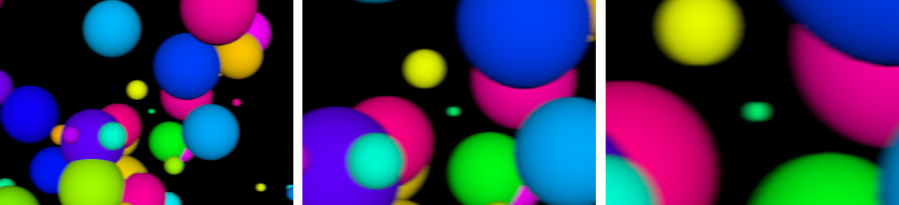](HorizontalBlurShader.html)

## HorizontalBlurShader X

A shader that blurs the frame horizontally with a variable Gaussian blur filter
by using the same number of samplings, but at different span. For a fixed filter
at *amount*=1 see [HorizontalBlurShader](#horizontalblurshader).
	
* **`amount`** – amount of shader effect (float, default value 1) 

Example: [HorizontalBlurShaderX.html](HorizontalBlurShaderX.html)
		
[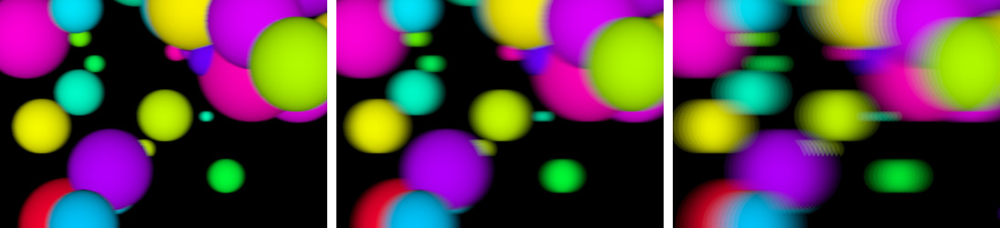](HorizontalBlurShaderX.html)

## HorizontalTiltShiftShader

A shader that makes the horizontal blur of a tilt-shift effect similar to the
[miniature faking](https://en.wikipedia.org/wiki/Miniature_faking) in [tilt-shift photography](https://en.wikipedia.org/wiki/Tilt–shift_photography#Miniature_faking). Both
horizontal blur and vertical blur (see [VerticalTiltShiftShader](#verticaltiltshiftshader)) are required for a full tilt-shift effect.
For an alternative implementation of the horizontal blur shader with different
parameters see [HorizontalTiltShiftShader X](#horizontaltiltshiftshader-x).
	
* **`r`** – position of the focus area (float, in NDC space units from 0 to 1, default value 0.35)

Example: [HorizontalTiltShiftShader.html](HorizontalTiltShiftShader.html)
		
[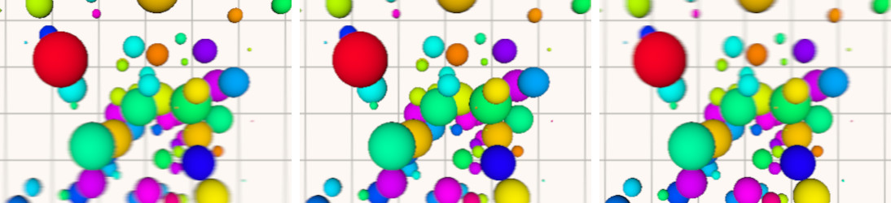](HorizontalTiltShiftShader.html)

## HorizontalTiltShiftShader X
A shader that makes the horizontal blur of a tilt-shift effect similar to the
miniature faking in tilt-shift photography. Both horizontal blur and vertical
blur (see [VerticalTiltShiftShader X](#verticaltiltshiftshader-x)) are required
for a full tilt-shift effect. For an alternative implementation of the horizontal
blur shader with different parameters see [HorizontalTiltShiftShader](#horizontaltiltshiftshader).

	
* **`position`** – position of the focus area (float, in NDC space units from 0 to 1, default value 0.5)
* **`span`** – size of the focus area (float, in NDC space units from 0 to 0.5, default value 0)
* **`amount`** – amount of blur effect (float, from 0 to 10, default value 1.5) 

Example: [HorizontalTiltShiftShaderX.html](HorizontalTiltShiftShaderX.html)
		
[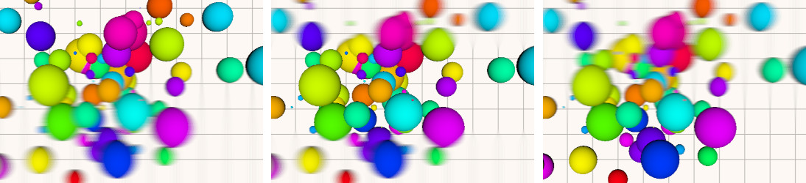](HorizontalTiltShiftShaderX.html)

## HueSaturationShader

A shader that changes the [hue](https://en.wikipedia.org/wiki/Hue) (the colorness
of colors, like *red*, *green* or *yellow*) and the
[saturation](https://en.wikipedia.org/wiki/Colorfulness#Saturation)
(the colorfulness or strength of colors, line *gray* or *colorful*) of a frame.
	
* **`hue`** – relative change of hue (float, from -1 to 1, default value 0)
* **`saturation`** – relative change of saturation (float, from -1 to 1, default value 0)

Example: [HueSaturationShader.html](HueSaturationShader.html)
		

## KaleidoShader

A shader that mirrors a pie fragment of the frame into a [kaleidoscopic](https://en.wikipedia.org/wiki/Kaleidoscope) image. For an aspect-friendly
version of this shader see [KaleidoShader X](#kaleidoshader-x).
	
* **`sides`** – number of side of the kaleidoscope image (int, 3 or more, default value 6)
* **`angle`** – rotation of the kaleidoscope image in radians (float, default value 0)

Example: [KaleidoShader.html](KaleidoShader.html)
		
[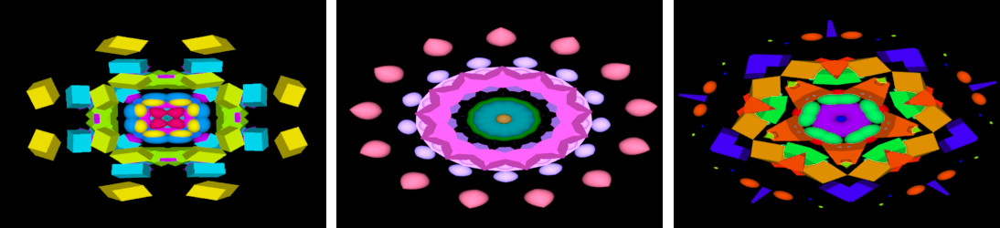](KaleidoShader.html)

## KaleidoShader X

A shader that mirrors a pie fragment of the frame into a [kaleidoscopic](https://en.wikipedia.org/wiki/Kaleidoscope) image. For a non-aspect
version of this shader see [KaleidoShader](#kaleidoshader).
	
* **`sides`** – number of side of the kaleidoscope image (int, 3 or more, default value 6)
* **`angle`** – rotation of the kaleidoscope image in radians (float, default value 0)

Example: [KaleidoShaderX.html](KaleidoShaderX.html)
		

## LuminosityHighPassShader

A shader that changes a frame by blending colors based on their luminocity.
In contrast to the [LuminosityShader](#luminosityshader), this shader calculates
the luminocity as &approx;30% (red), &approx;59% (green) and &approx;11%(blue).
	
* **`defaultColor`** – default color to blend to (color, default value THREE.Color(0,0,0)) 
* **`defaultOpacity`** – alpha component of the default color (float, from 0 to 1, default value 0) 
* **`luminosityThreshold`** – minimal luminocity for blending (float, from -1 to 1, default value 1) 
* **`smoothWidth`** – blending span, i.e. it is applied for luminocities from *threshold-smoothWidth* to *threshold+smoothWidth* (float, from -1 to 1, default value 1) 

Example: [LuminosityHighPassShader.html](LuminosityHighPassShader.html)
		
[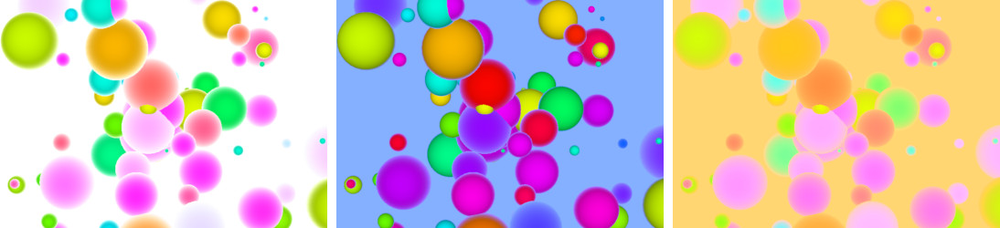](LuminosityHighPassShader.html)
		

## LuminosityShader

A shader that converts colors of a frame to grayscale based on luminocity, i.e.
color components contribute with their different factors: &approx;21% (red),
&approx;72% (green) and &approx;7%(blue). A more advanced lunimosity sader is
[LuminosityHighPassShader](#luminosityhighpassshader).
	
* *no parameters*

Example: [LuminosityShader.html](LuminosityShader.html)
		
[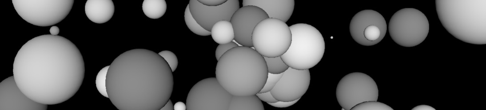](LuminosityShader.html)

## MirrorShader

A shader that mirrors half of the frame onto the other half.
	
* **`side`** – which half frame is the source of mirror (int, from 0 to 3, default value 1)
	<small>  &nbsp; &nbsp; 0 = left&rarr;right
	  &nbsp; &nbsp; 1 = right&rarr;left
	  &nbsp; &nbsp; 2 = top&rarr;bottom
	  &nbsp; &nbsp; 3 = bottom&rarr;top</small>

Example: [MirrorShader.html](MirrorShader.html)
		
[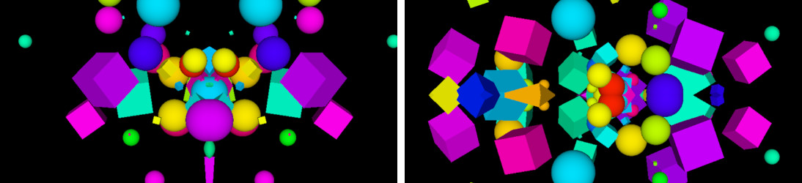](MirrorShader.html)

		

<!--
## MotionBlurShader
[ type: S2 ]<big style="color: Crimson">

A shader that applies the frame onto cumulative image of older versions of the frame, thus
building a motion blur effect. This effect is similar to [AfterimageShader](#afterimageshader).
	
* **`damp`** – damping factor, i.e. how much of the old frame to use (float, from 0 to 1, default value 0.9) 

Example: [MotionBlurShader.html](MotionBlurShader.html)
		

-->

## RGBShiftShader

A shader that splits the RGB color components of the frame and shifts them apart.

* **`amount`** – amount of shift (float, in NDC space units, default value 0.005)
* **`angle`** – angle of offset (float, in radians, default value 0.0)

Example: [RGBShiftShader.html](RGBShiftShader.html)
		

## SepiaShader

A shader that recolors the frame into [sepia color](https://en.wikipedia.org/wiki/Sepia_(color)).

* **`amount`** – amount of recoloring (float, from 0 to 1, default value 1)

Example: [SepiaShader.html](SepiaShader.html)
		
[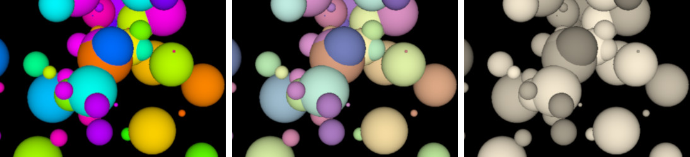](SepiaShader.html)
		

## SobelOperatorShader

A shader that applies a [Sobel operator](https://en.wikipedia.org/wiki/Sobel_operator)
 on a frame and detects the edges of shapes based on the red color component.
	
* *no parameters*

Example: [SobelOperatorShader.html](SobelOperatorShader.html)
		
[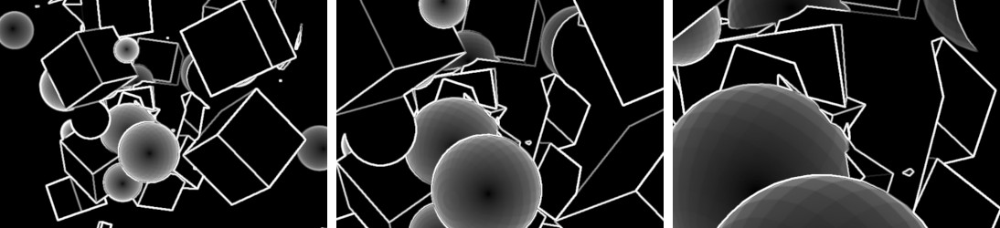](SobelOperatorShader.html)

## TechnicolorShader

A shader that converts the colors of the frame into [Technicolor cyan-red hues](https://en.wikipedia.org/wiki/Technicolor#Two-color_Technicolor). For an
extended version of this shader see [TechnicolorShader X](#technicolorshader-x).
	
* *no parameters*

Example: [TechnicolorShader.html](TechnicolorShader.html)
		
[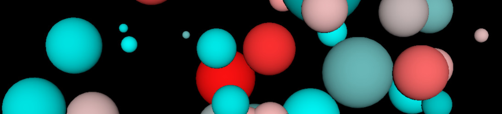](TechnicolorShader.html)

## TechnicolorShader X

A shader that converts the colors of the frame into Technicolor cyan-red. The
shader extends the [TechnicolorShader](#technicolorshader) by adding `amount`.
	
* **`amount`** – amount of recoloring (float, from 0 to 1, default value 1)

Example: [TechnicolorShaderX.html](TechnicolorShaderX.html)
		
[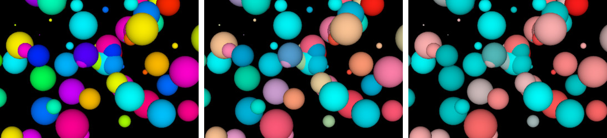](TechnicolorShaderX.html)

## TriangleBlurShader

A shader that blurs the frame using randomized weighted samples.
The blur is biased along a direction.
	
* **`amount`** – amount of shader effect in both directions (vector, components in NDC space units from 0 to 1, default value THREE.Vector2(0,0)) 

To use this shader for a non-biased blur, it must be applied twice:
a horizontal blur in one shader (e.g. *amount*=(0.1,0)) and a vertical
blur in another shader (e.g. *amount*=(0,0.1)).

Example: [TriangleBlurShader.html](TriangleBlurShader.html)
		
[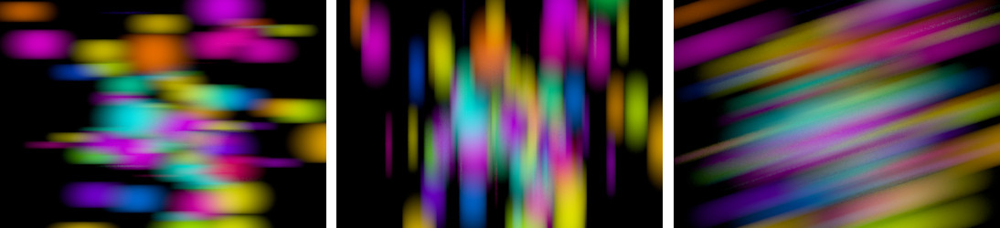](TriangleBlurShader.html)

## UnpackDepthRGBAShader

A shader that assumes the frame contains RGBA encoded depth data and unpacks it into grayscale colors.
	
* **`opacity`** – shader effect opacity (float, from 0 to 1, default value 1) 

Example: [UnpackDepthRGBAShader.html](UnpackDepthRGBAShader.html)
		

## VerticalBlurShader

A shader that blurs the frame vertically with a fixed Gaussian blur filter.
For a variable filter see [VerticalBlurShader X](#verticalblurshader-x).
	
Example: [VerticalBlurShader.html](VerticalBlurShader.html)
		
[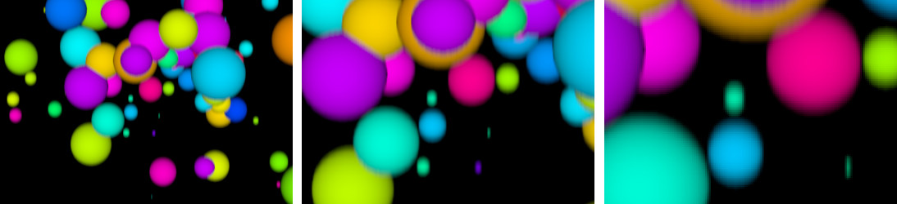](VerticalBlurShader.html)

## VerticalBlurShader X

A shader that blurs the frame vertically with a variable Gaussian blur filter
by using the same number of samplings, but at different span. For a fixed filter
at *amount*=1 see [VerticalBlurShader](#verticalblurshader).
	
* **`amount`** – amount of shader effect (float, default value 1) 

Example: [VerticalBlurShaderX.html](VerticalBlurShaderX.html)
		
[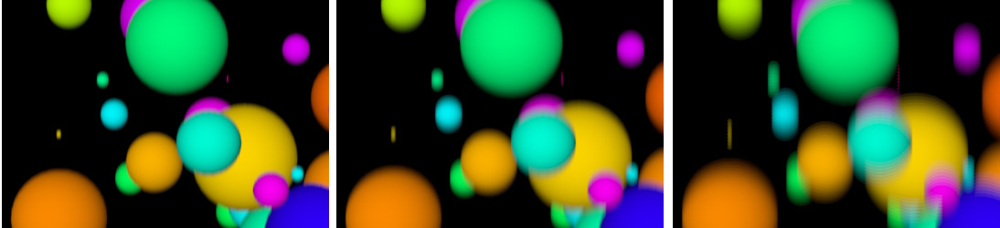](VerticalBlurShaderX.html)

## VerticalTiltShiftShader

A shader that makes the vertical blur of a tilt-shift effect similar to the
[miniature faking](https://en.wikipedia.org/wiki/Miniature_faking) in [tilt-shift photography](https://en.wikipedia.org/wiki/Tilt–shift_photography#Miniature_faking). Both
horizontal blur (see [HorizontalTiltShiftShader](#horizontaltiltshiftshader)) and vertical blur are required for a full tilt-shift effect.
For an alternative implementation of the vertical blur shader with different
parameters see [VerticalTiltShiftShader X](#verticaltiltshiftshader-x).
	
* **`r`** – position of the focus area (float, in NDC space units from 0 to 1, default value 0.35)

Example: [VerticalTiltShiftShader.html](VerticalTiltShiftShader.html)
		
[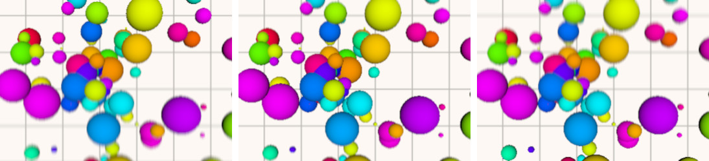](VerticalTiltShiftShader.html)

## VerticalTiltShiftShader X

A shader that makes the vertical blur of a tilt-shift effect similar to the
miniature faking in tilt-shift photography. Both horizontal blur (see [HrizontalTiltShiftShader X](#horizontaltiltshiftshader-x)) and vertical
blur are required
for a full tilt-shift effect. For an alternative implementation of the horizontal
blur shader with different parameters see [VerticalTiltShiftShader](#verticaltiltshiftshader).

	
* **`position`** – position of the focus area (float, in NDC space units from 0 to 1, default value 0.5)
* **`span`** – size of the focus area (float, in NDC space units from 0 to 0.5, default value 0)
* **`amount`** – amount of blur effect (float, from 0 to 10, default value 1.5) 

Example: [VerticalTiltShiftShaderX.html](VerticalTiltShiftShaderX.html)
		
[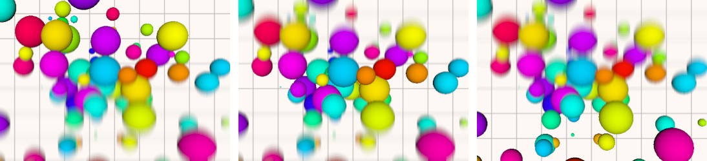](VerticalTiltShiftShaderX.html)

## VignetteShader

A shader that adds a [vignette effect](https://en.wikipedia.org/wiki/Vignetting) on the frame. For an alternative
implementation with different parameters see [VignetteShader X](#vignetteshader-x).
	
* **`offset`** – relative inward distance (float, from 0 to 5, default value 1), larger values shrink the vignette oval
* **`darkness`** – amount of intensity reduction (float, from -5 to 5, default value 1), negative values brightens the frame, positive values darkens the frame

Example: [VignetteShader.html](VignetteShader.html)
		
[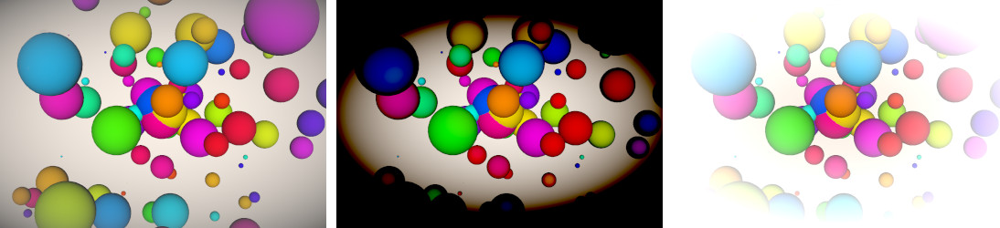](VignetteShader.html)

## VignetteShader X

A shader that adds a vignette effect on the frame.  For an alternative
implementation with different parameters see [VignetteShader](#vignetteshader).
	
* **`radius`** – relative outward vignette radius (float, in NDC space units, default value 1)
* **`blur`** – amount of blur effect on vignette border (float, 0 for no blur, default value 1) 
* **`color`** – vignette color (color, default value THREE.Color(0,0,0) for black color) 

Example: [VignetteShaderX.html](VignetteShaderX.html)
		
[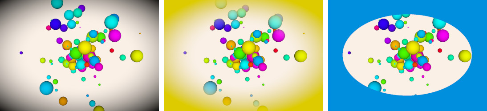](VignetteShaderX.html)
