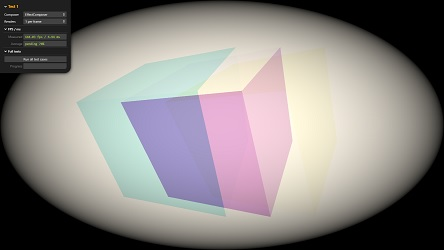
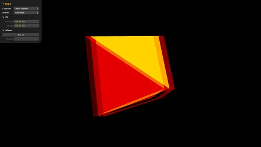

# Preliminary Tests

This page contains a few preliminary tests to measure and compare performance
of the traditional use of postprocessing effects versus the new approach. To
isolate rendering time, each test runs N = 1, 2, ... 1024 renderings per frame.
A temporal average is calculated every second and the final results are
collected after continuous full-screen running for 20 seconds.

The tests are preliminary and not statistically sound.

## Test 1 <small>[Merging 2 shaders in one]</small>

This test merges 2 simple shaders ([RGBShiftShader](../examples/index.md#rgbshiftshader)
and [ColorifyShader](../examples/index.md#colorifyshader))
into one OOPS shader. The shader is used by a ShaderPass in an EffectComposer.
Merging increases performance by **20%-40%** ([details](test-1-details.md)).

Run: [test-1.html](test-1.html)
	

## Test 2 <small>[Merging 3 shaders in one]</small>

This test merges 3 simple shaders ([RGBShiftShader](../examples/index.md#rgbshiftshader),
[ColorifyShader](../examples/index.md#colorifyshader) and
[BrightnessContrastShader](../examples/index.md#brightnesscontrastshader)
) into one OOPS shader. The shader is used by a ShaderPass in an EffectComposer.
Merging increases performance by **40%-55%** ([details](test-2-details.md)).

Run: [test-2.html](test-2.html)
	

