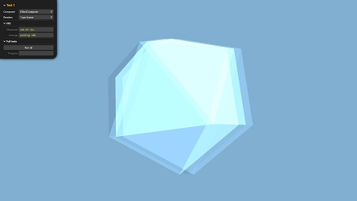
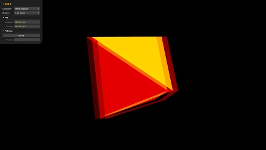
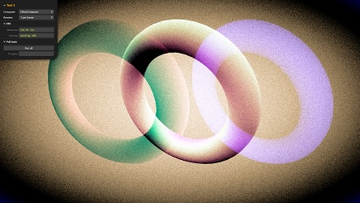
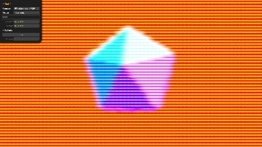
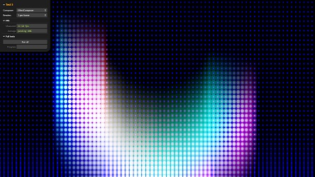

# Performance Tests

This page contains preliminary tests to measure and compare performance of the
traditional use of postprocessing effects versus the new approach. Each test
renders the scene 1, 2, ... 1024 times per frame. A temporal average is
calculated every second and the final results are collected after continuous
full-screen running for around 20 seconds or more.

## Test 1 &ndash; Merging 2 simple effects

This test merges 2 simple effects ([RGBShift](../gallery/index.md#rgbshift)
and [Colorify](../gallery/index.md#colorify)). Performance is increased by
**20%-30%** ([raw data](test-1/rawdata.md)) on various hardware configurations.

Run: [test-1.html](test-1/index.html)
	

<!--
## Test 2 <small>[Merging 3 shaders in one]</small>

This test merges 3 simple shaders ([RGBShiftShader](../gallery/index.md#rgbshiftshader),
[ColorifyShader](../gallery/index.md#colorifyshader) and
[BrightnessContrastShader](../gallery/index.md#brightnesscontrastshader)) into
one OOPS shader. The shader is used by a ShaderPass in an EffectComposer.
Merging increases performance by **40%-70%** ([details](test-2/details.md)).

Run: [test-2.html](test-2/index.html)
	

## Test 3 <small>[Merging 4 shaders in one]</small>

This test merges 4 simple shaders ([RGBShiftShader](../gallery/index.md#rgbshiftshader),
[FilmShader](../gallery/index.md#filmshader),
[VignetteShader](../gallery/index.md#vignetteshader) and
[BleachBypassShader](../gallery/index.md#bleachbypassshader)) into one OOPS
shader. The shader is used by a ShaderPass in an EffectComposer.
Merging increases performance by **70%-100%** ([details](test-3/details.md)).

Run: [test-3.html](test-3/index.html)
	

## Test 4 <small>[Merging shaders with many samplings]</small>

This test merges 2 shaders ([HalftoneShader](../gallery/index.md#halftoneshader)
and [ConvolutionShader](../gallery/index.md#convolutionshader)) into one OOPS
shader. The shader is used by a ShaderPass in an EffectComposer. The shaders
samples a texture 109 and 25 times. Using the shaders in separate passes results
in 109+25=134 samplings per fragment, while merging the shaders results to 
109&times;25=2725 samplings. The overall results is that in this case merging
**decreases performance by 65%-80%** ([details](test-4/details.md)).

Run: [test-4.html](test-4/index.html)
	

## Test 5 <small>[Splitting shaders with many samplings]</small>

This test uses 2 shaders ([HalftoneShader](../gallery/index.md#halftoneshader)
and [ConvolutionShader](../gallery/index.md#convolutionshader)) automatically
split into to separate passes. The performance increase is because of baked
uniforms. The overall results is that in this case splitting
**increases performance by 5%-70%** ([details](test-5/details.md)).

Run: [test-5.html](test-5/index.html)
	

-->