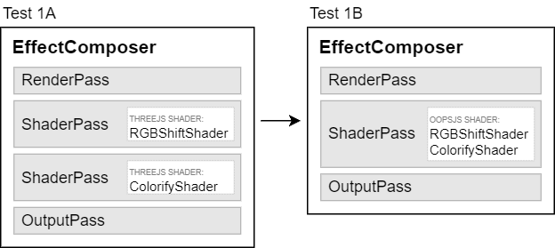

# Test 1 <small><small>[RGBShift + Colorify]</small></small>

### Run №1

* NVIDIA GeForce GTX 1660 Ti + ANGLE(Direct3D11)
* Resolution 1536x864 (1920x1080)
* 1/1/2024, 9:59:22 AM

| Renderings | A fps | B fps | Gain |
| :-: | :-: | :-: | :-: |
| 1 | 144 | 144 | (+0%) |
| 2 | 144 | 144 | (+0%) |
| 4 | 144 | 144 | (+0%) |
| 8 | 144 | 144 | (+0%) |
| 16 | 107 | 144 | (+34%) |
| 32 | 55.2 | 75.9 | +37% |
| 64 | 28.0 | 38.6 | +38% |
| 128 | 14.1 | 19.5 | +38% |
| 256 | 7.09 | 9.80 | +38% |
| 512 | 3.56 | 4.91 | +38% |
| 1024 | 1.80 | 2.67 | +49% |

<small>*Note: Values in parentheses are unreliable, as at least
one of the measured FPS is restricted by the browser animation loop.*</small>

### Run №2

* Intel UHD Graphics 630 + ANGLE(Direct3D11)
* Resolution 1536x864 (1920x1080)
* 1/1/2024, 10:18:10 AM

| Renderings | A fps | B fps | Gain |
| :-: | :-: | :-: | :-: |
| 1 | 141 | 144 | (+2%) |
| 2 | 88.7 | 106 | +19% |
| 4 | 52.0 | 61.1 | +18% |
| 8 | 29.0 | 35.3 | +22% |
| 16 | 15.2 | 18.6 | +22% |
| 32 | 7.76 | 9.53 | +23% |
| 64 | 3.92 | 4.87 | +24% |
| 128 | 1.96 | 2.42 | +23% |
| 256 | 0.980 | 1.21 | +24% |
| 512 | 0.491 | 0.608 | +24% |
| 1024 | 0.246 | 0.304 | +24% |

<small>*Note: Values in parentheses are unreliable, as at least
one of the measured FPS is restricted by the browser animation loop.*</small>

### Run №3

* Intel HD Graphics 4000 + ANGLE(Direct3D11)
* Resolution 1368x768 (1368x768)
* 1/1/2024, 5:12:06 PM

| Renderings | A fps | B fps | Gain |
| :-: | :-: | :-: | :-: |
| 1 | 40.0 | 40.0 | (+0%) |
| 2 | 40.0 | 40.0 | (+0%) |
| 4 | 38.6 | 40.0 | (+4%) |
| 8 | 20.6 | 28.5 | +39% |
| 16 | 10.6 | 14.4 | +36% |
| 32 | 5.45 | 7.49 | +37% |
| 64 | 2.71 | 3.73 | +37% |
| 128 | 1.36 | 1.86 | +37% |
| 256 | 0.637 | 0.957 | +50% |
| 512 | 0.346 | 0.570 | +65% |
| 1024 | 0.178 | 0.241 | +36% |

<small>*Note: Values in parentheses are unreliable, as at least
one of the measured FPS is restricted by the browser animation loop.*</small>
