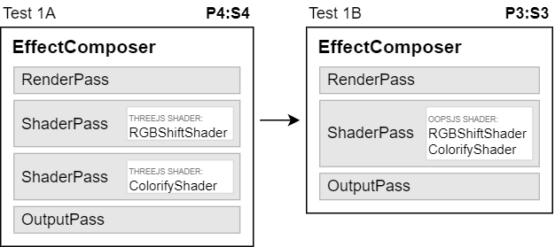

# Test 1 Raw Data

The tabular data contains: (1) number of renderings per frame; (2) averate FPS
for EffectsComposer; (3) average FPS for Effects + oops.js; and (4) performance gain

```
3/14/2024, 11:00:53 AM
Resolution 1536x864 (1920x1080)
Intel(R) UHD Graphics 630
Direct3D11 vs_5_0 ps_5_0, D3D11

1 144 144 (+0%)
2 95.7 111 (+16%)
4 56.0 66.1 (+18%)
8 30.3 36.2 (+20%)
16 15.9 19.1 (+20%)
32 8.12 9.80 (+21%)
64 4.10 4.46 (+9%)
128 1.92 2.32 (+21%)
256 0.920 1.13 (+23%)
512 0.462 0.574 (+24%)
1024 0.248 0.302 (+22%)
```


```
3/14/2024, 11:14:19 AM
Resolution 1536x864 (1920x1080)
NVIDIA GeForce GTX 1660 Ti
Direct3D11 vs_5_0 ps_5_0, D3D11

1 144 144 (+0%)
2 144 144 (+0%)
4 144 144 (+0%)
8 144 144 (+0%)
16 144 144 (+0%)
32 92.5 117 (+27%)
64 47.0 59.9 (+27%)
128 23.7 30.2 (+28%)
256 11.9 15.2 (+28%)
512 5.96 7.61 (+28%)
1024 2.98 3.81 (+28%)
```


<!--
# Test 1<br><small>[Merging 2 shaders in one]</small>




### Run №1

* NVIDIA GeForce GTX 1660 Ti + ANGLE(Direct3D11)
* Resolution 1536x864 (1920x1080)
* Jan 1, 2024

| Renderings | A fps | B fps | Gain |
| :-: | :-: | :-: | :-: |
| 1 | 144 | 144 | +0% |
| 2 | 144 | 144 | +0% |
| 4 | 144 | 144 | +0% |
| 8 | 144 | 144 | +0% |
| 16 | 107 | 144 | +34% |
| 32 | 55.2 | 75.9 | +37% |
| 64 | 28.0 | 38.6 | +38% |
| 128 | 14.1 | 19.5 | +38% |
| 256 | 7.09 | 9.80 | +38% |
| 512 | 3.56 | 4.91 | +38% |
| 1024 | 1.80 | 2.67 | +49% |


### Run №2

* Intel UHD Graphics 630 + ANGLE(Direct3D11)
* Resolution 1536x864 (1920x1080)
* Jan 1, 2024

| Renderings | A fps | B fps | Gain |
| :-: | :-: | :-: | :-: |
| 1 | 141 | 144 | +2% |
| 2 | 88.7 | 106 | +19% |
| 4 | 52.0 | 61.1 | +18% |
| 8 | 29.0 | 35.3 | +22% |
| 16 | 15.2 | 18.6 | +22% |
| 32 | 7.76 | 9.53 | +23% |
| 64 | 3.92 | 4.87 | +24% |
| 128 | 1.96 | 2.42 | +23% |
| 256 | 0.980 | 1.21 | +24% |
| 512 | 0.491 | 0.608 | +24% |
| 1024 | 0.246 | 0.304 | +24% |


### Run №3

* Intel HD Graphics 4000 + ANGLE(Direct3D11)
* Resolution 1368x768 (1368x768)
* Jan 1, 2024

| Renderings | A fps | B fps | Gain |
| :-: | :-: | :-: | :-: |
| 1 | 40.0 | 40.0 | +0% |
| 2 | 40.0 | 40.0 | +0% |
| 4 | 38.6 | 40.0 | +4% |
| 8 | 20.6 | 28.5 | +39% |
| 16 | 10.6 | 14.4 | +36% |
| 32 | 5.45 | 7.49 | +37% |
| 64 | 2.71 | 3.73 | +37% |
| 128 | 1.36 | 1.86 | +37% |
| 256 | 0.637 | 0.957 | +50% |
| 512 | 0.346 | 0.570 | +65% |
| 1024 | 0.178 | 0.241 | +36% |

-->