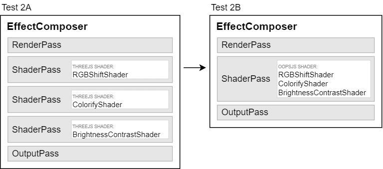

# Test 2 <small>[Merging 3 shaders in one]</small>

### Run №1

* NVIDIA GeForce GTX 1660 Ti + ANGLE(Direct3D11)
* Resolution 1536x864 (1920x1080)
* Jan 2, 2024

| Renderings | A fps | B fps | Gain |
| :-: | :-: | :-: | :-: |
| 1 | 144 | 144 | +0% |
| 2 | 144 | 144 | +0% |
| 4 | 144 | 144 | +0% |
| 8 | 144 | 144 | +0% |
| 16 | 144 | 144 | +0% |
| 32 | 76.9 | 119 | +54% |
| 64 | 38.8 | 60.3 | +56% |
| 128 | 19.6 | 30.5 | +56% |
| 256 | 9.79 | 15.3 | +56% |
| 512 | 4.91 | 7.70 | +57% |
| 1024 | 2.30 | 3.83 | +67% |

### Run №2

* Intel UHD Graphics 630 + ANGLE(Direct3D11)
* Resolution 1536x864 (1920x1080)
* Jan 2, 2024

| Renderings | A fps | B fps | Gain |
| :-: | :-: | :-: | :-: |
| 1 | 126 | 144 | +14% |
| 2 | 82.4 | 108 | +31% |
| 4 | 47.5 | 64.2 | +35% |
| 8 | 25.5 | 35.5 | +39% |
| 16 | 13.0 | 18.6 | +44% |
| 32 | 6.79 | 9.64 | +42% |
| 64 | 3.42 | 4.87 | +42% |
| 128 | 1.72 | 2.46 | +43% |
| 256 | 0.858 | 1.23 | +44% |
| 512 | 0.431 | 0.617 | +43% |
| 1024 | 0.217 | 0.309 | +42% |

### Run №3

* Intel HD Graphics 4000 + ANGLE(Direct3D11)
* Resolution 1368x768 (1368x768)
* Jan 2, 2024

| Renderings | A fps | B fps | Gain |
| :-: | :-: | :-: | :-: |
| 1 | 40.3 | 39.1 -3% |
| 2 | 29.9 | 33.8 | +13% |
| 4 | 20.3 | 26.7 | +32% |
| 8 | 12.0 | 15.5 | +29% |
| 16 | 7.81 | 13.6 | +73% |
| 32 | 4.16 | 7.05 | +70% |
| 64 | 2.13 | 3.64 | +70% |
| 128 | 1.08 | 1.86 | +72% |
| 256 | 0.545 | 0.943 | +73% |
| 512 | 0.273 | 0.474 | +73% |
| 1024 | 0.137 | 0.238 | +73% |

