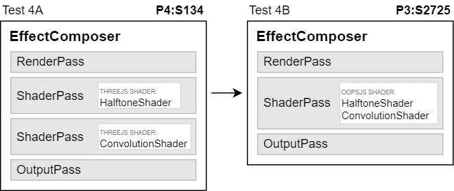

# Test 4 <small>[Merging shaders with many samplings]</small>

### Run №1

* NVIDIA GeForce GTX 1660 Ti + ANGLE(Direct3D11)
* Resolution 1536x864 (1920x1080)
* Jan 17, 2024

| Renderings | A fps | B fps | Gain |
| :-: | :-: | :-: | :-: |
| 1 | 144 | 101 | -30% |
| 2 | 144 | 52.0 | -64% |
| 4 | 95.1 | 25.9 | -73% |
| 8 | 48.2 | 13.0 | -73% |
| 16 | 24.2 | 6.54 | -73% |
| 32 | 12.1 | 3.29 | -73% |
| 64 | 6.04 | 1.64 | -73% |
| 128 | 3.02 | 0.823 | -73% |
| 256 | 1.51 | 0.787 | -48% |
| 512 | 1.09 | 0.574 | -47% |
| 1024 | 0.392 | 0.11 | -72% |

### Run №2

* Intel UHD Graphics 630 + ANGLE(Direct3D11)
* Resolution 1536x864 (1920x1080)
* Jan 17, 2024

| Renderings | A fps | B fps | Gain |
| :-: | :-: | :-: | :-: |
| 1 | 37.1 | 8.95 | -76% |
| 2 | 19.4 | 4.52 | -77% |
| 4 | 9.91 | 2.27 | -77% |
| 8 | 5.01 | 1.14 | -77% |
| 16 | 2.51 | 0.573 | -77% |
| 32 | 1.34 | 0.307 | -77% |
| 64 | 0.671 | 0.140 | -79% |
| 128 | 0.310 | 0.072 | -77% |
| 256 | 0.158 | 0.036 | -77% |
| 512 | n/a | n/a | n/a |
| 1024 | n/a | n/a | n/a |

### Run №3 - ongoing

* Intel HD Graphics 4000 + ANGLE(Direct3D11)
* Resolution 1368x768 (1368x768)
* Jan 17, 2024

| Renderings | A fps | B fps | Gain |
| :-: | :-: | :-: | :-: |
<!--
| 1 | 36.8 | 35.0 | -5% |
| 2 | 27.2 | 31.8 | +17% |
| 4 | 17.1 | 25.0 | +46% |
| 8 | 11.0 | 18.5 | +68% |
| 16 | 6.22 | 12.9 | +108% |
| 32 | 3.35 | 6.69 | +100% |
| 64 | 1.71 | 3.46 | +102% |
| 128 | 0.868 | 1.76 | +103% |
| 256 | 0.437 | 0.894 | +105% |
| 512 | 0.219 | 0.450 | +106% |
| 1024 | 0.110 | 0.226 | +106% |
-->
