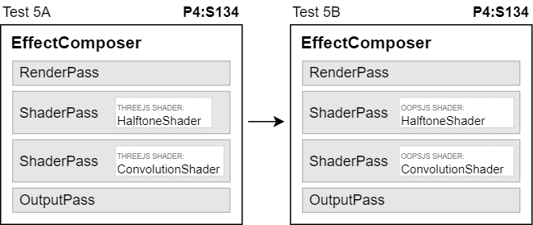

# Test 5 <small>[Splitting shaders with many samplings]</small>

### Run №1

* NVIDIA GeForce GTX 1660 Ti + ANGLE(Direct3D11)
* Resolution 1536x864 (1920x1080)
* Jan 28, 2024

| Renderings | A fps | B fps | Gain |
| :-: | :-: | :-: | :-: |
| 1 | 144 | 144 | +0% |
| 2 | 144 | 144 | +0% |
| 4 | 97.4 | 103 | +6% |
| 8 | 49.4 | 52.4 | +6% |
| 16 | 24.9 | 26.5 | +6% |
| 32 | 12.5 | 13.3 | +6% |
| 64 | 6.27 | 6.63 | +6% |
| 128 | 3.14 | 3.32 | +6% |
| 256 | 1.57 | 1.66 | +6% |
| 512 | 0.785 | 0.832 | +6% |
| 1024 | 0.397 | 0.440 | +11% |

### Run №2

* Intel UHD Graphics 630 + ANGLE(Direct3D11)
* Resolution 1536x864 (1920x1080)
* Jan 28, 2024

| Renderings | A fps | B fps | Gain |
| :-: | :-: | :-: | :-: |
| 1 | 36.7 | 59.1 | +61% |
| 2 | 19.2 | 32.0 | +67% |
| 4 | 9.80 | 16.6 | +70% |
| 8 | 4.95 | 8.48 | +71% |
| 16 | 2.49 | 4.27 | +71% |
| 32 | 1.25 | 2.15 | +72% |
| 64 | 0.621 | 1.05 | +68% |
| 128 | 0.313 | 0.545 | +74% |
| 256 | 0.157 | 0.270 | +72% |
| 512 | 0.079 | 0.135 | +72% |
| 1024 | n/a | n/a | n/a |

### Run №3

* Intel HD Graphics 4000 + ANGLE(Direct3D11)
* Resolution 1368x768 (1368x768)
* Jan 28, 2024

| Renderings | A fps | B fps | Gain |
| :-: | :-: | :-: | :-: |
| 1 | 24.4 | 28.6 | +17% |
| 2 | 12.8 | 15.7 | +23% |
| 4 | 6.57 | 8.11 | +24% |
| 8 | 3.32 | 4.09 | +23% |
| 16 | 1.68 | 2.06 | +23% |
| 32 | 0.841 | 1.04 | +23% |
| 64 | 0.667 | 0.685 | +3% |
| 128 | 0.213 | 0.336 | +58% |
| 256 | n/a | n/a | n/a |
| 512 | n/a | n/a | n/a |
| 1024 | n/a | n/a | n/a |

