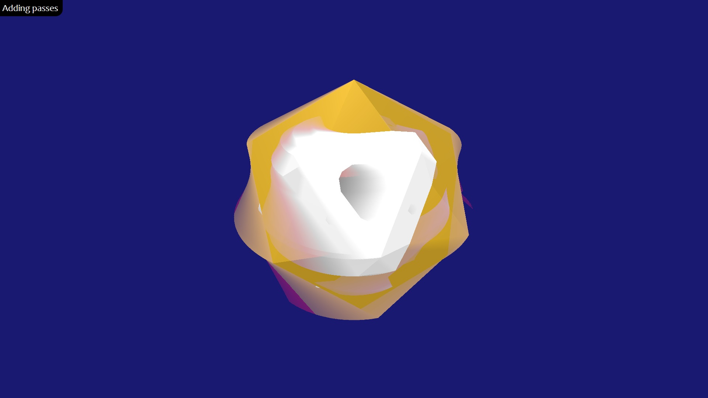

# Short Tutorial

This tutorial assumes you are already familiar with Three.js effect composer.
The post-processing effects in Oops.js reuse the code-base of Three.js as much
as it is reasonable &ndash; this includes passes and shaders from Three.js Add-ons.

## Importing

Oops.js is an external add-on, and must be imported explicitly.
```js
// importing Oops.js
import { Effects } from 'oops';
```


## Rendering

The effects composer in Oops.js is called **`Effects`** and rendering of
post-processing effects is done with its **`.render`** method.

```js
// creating effect composer
var effects = new Effects( renderer );

// rendering effects
function animate( time ) {
	effects.render( scene, camera );
}
```


## Adding effects

<small>**Tip:** For a list of available effects see the [Effects Gallery](../gallery/).</small>

Effects are added with the **addEffect** method. Oops.js reuses the code-base of
Three.js. The next example demonstrates how to create a post-processing 
effect combining the shaders of [Sepia](../gallery/index.md#sepia) and
[Film](../gallery/index.md#film) effects.

```js
var effects = new Effects( renderer )
		.addEffect( SepiaShader )
		.addEffect( FilmShader );
```

Run: [Adding shaders](adding-shaders/index.html)
	
[](adding-shaders/index.html)

Some effects have dedicated passes. It is recommended to always use the pass,
as it may contain additional functionality, not present in the shader. The next
example uses the pass of [Afterimage](../gallery/index.md#afterimage) effect.

```js
var effects = new Effects( renderer )
		.addEffect( new AfterimagePass(0.99) );
```

Run: [Adding passes](adding-passes/index.html)
	
[](adding-passes/index.html)


<!--

## Adding effects

The effect composer collects effects and renders them in the animation loop.
Effects are always applied in the order they are added. The composer attempts to
merge effects in order to increase the overall rendering speed.

Effects are added with `.addEffect`. As most methods of `Effects` are chainable,
this could be done in both ways:

```js
var effects = new Effects( renderer );

effects.addEffect( ... );
effects.addEffect( ... );
```

or

```js
var effects = new Effects( renderer )
    .addEffect( ... )
    .addEffect( ... );
```

In Three.js some simple post-processing effects are defined as just shaders,
while other more complex effects have their own passes. If some effect have a
dedicated pass, it is better to use the pass, not its shader.

The following demo shows the

* [Sepia](../examples/index.md#sepiashader) to colorize the scene in [sepia color](https://en.wikipedia.org/wiki/Sepia_(color))
* [Film](../examples/index.md#filmshader) to add dynamic TV-like noise


```js
var composer = new Effects( renderer );

composer.addEffect( 'Sepia' );
composer.addEffect( 'Film' );
```

The `.addEffect` method is chainable, so the same code couls be shortened as:

```js
var composer = new Effects( renderer )
    .addEffect( 'Sepia' )
    .addEffect( 'Film' );
```


Run: [Simple effect demo](simple-effect/index.html)
	
[](simple-effect/index.html)

For a list of available effects see the [Examples](../examples) page.


### Customizing effects

Almost all postprocessing effects have parameters that specify their properties.
These parameters have preset default values that can be changed statically (i.e.
only once, at initialization) or dynamically (i.e. at each frame of an animation). 

#### Static parameters

Static parameters are hard-coded or baked into the shader code. This makes the
postprocessing faster as the shader compiler can optimize the code.

Static parameters are provided as an optional second parameter of `.addEffect`
&ndash; an object with parameter names and values. The following demo shows
three overlapping [Halftone](../examples/index.md#halftoneshader) effects with
custom static parameters.


```js
var zero = new THREE.Vector3(0,0,0);
var composer = new Effects( renderer )
    .addEffect( 'Halftone', {radius: 80/1, rotate: zero, blending: 0.2} )
    .addEffect( 'Halftone', {radius: 80/3, rotate: zero, blending: 0.4} )
    .addEffect( 'Halftone', {radius: 80/9, rotate: zero, blending: 0.3} );
```

Run: [Static parameters demo](static-parameters/index.html)
	
[](static-parameters/index.html)

For a list of available parameters to each effect see the [Examples](../examples) page.


#### Dynamic parameters

TO DO


#### Automatic parameters

TO DO


### Video postprocessing

Although the postprocessing effects cannot be applied directly on a video,
they can be applied on a video, rendered on the screen. This demo displayes a video via a [video texture](https://threejs.org/docs/#api/en/textures/VideoTexture)
and applies 4 postprocessing effects onto it:
* [Halftone](../examples/index.md#halftoneshader) to create dotted pattern of the video
* [HueSaturation](../examples/index.md#huesaturationshader) to change dynamically the color
* [Vignette](../examples/index.md#vignetteshader) to frame the image in an ellipse
* [TriangleBlur](../examples/index.md#triangleblurshader) to smooth effect transitions

Run: [Video effect demo](video-effect/index.html)
	
[](video-effect/index.html)

-->